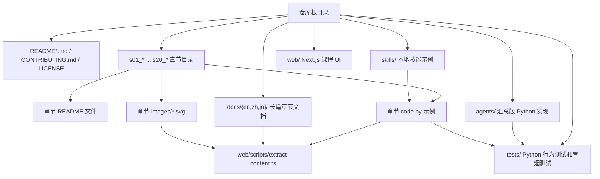
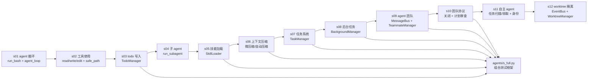
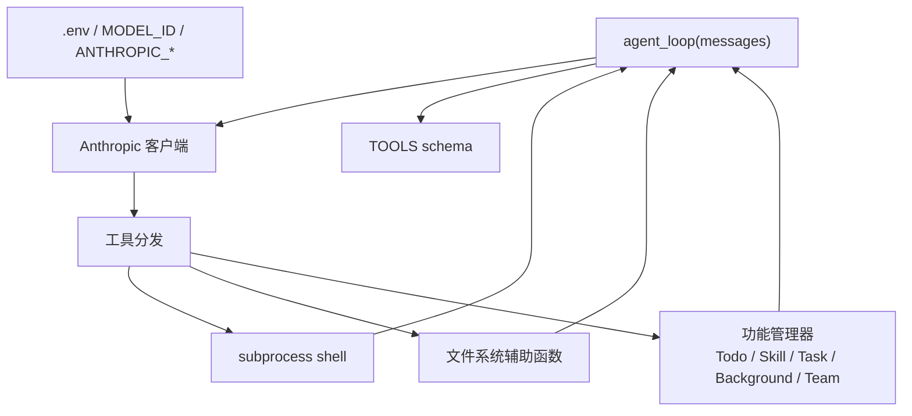
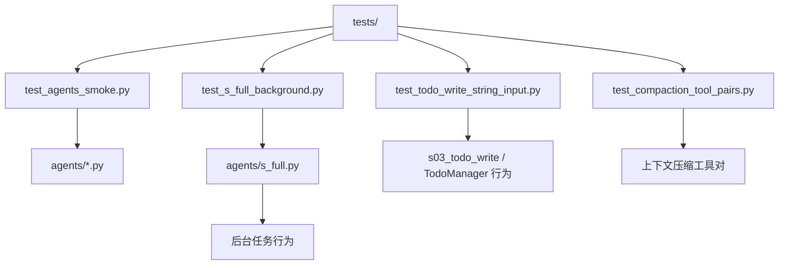
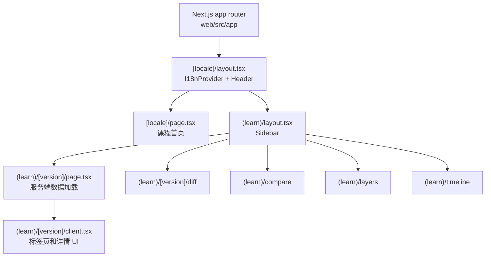
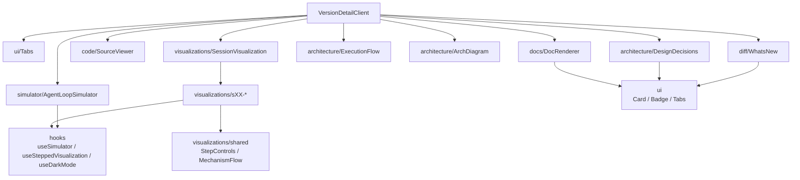
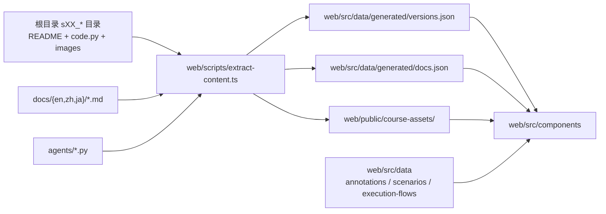

# 代码图谱

本文档从代码结构层面梳理本仓库。它是刻意保持静态并纳入源码管理的文档，方便随代码一起审查，并在目录结构或主要依赖发生变化时更新。

## 仓库概览

## Python Agent 代码

根目录下的 `sXX_*/code.py` 文件是各章节示例。`agents/` 目录包含命名相近的汇总版实现，供测试使用，也方便希望在一个位置查看所有版本的读者阅读。

### 共享 Python 运行时依赖

### Python 测试覆盖图

## Web 应用代码

`web/` 应用是一个 Next.js UI，用于渲染课程、代码、架构图、模拟器和 diff。构建命令和开发命令会先运行 `web/scripts/extract-content.ts`，该脚本会从仓库中复制/提取源材料，并生成 JSON 与 public 资源。

### Web 组件图

### Web 数据流水线

## 重要模块职责

| 区域 | 路径 | 职责 |
| --- | --- | --- |
| Python 章节示例 | `s01_*` 到 `s20_*` | 每章对应的源码、README 内容和图表。 |
| 汇总版 agent 实现 | `agents/` | 独立 Python 版本，以及组合测试框架 `s_full.py`。 |
| 测试 | `tests/` | 冒烟检查，以及针对 todo、压缩和后台任务功能的聚焦行为测试。 |
| 内容提取 | `web/scripts/extract-content.ts` | 基于根目录文档、代码和资源构建生成的 Web 数据。 |
| Next 路由 | `web/src/app/` | 支持 locale 的应用页面和版本详情路由。 |
| 课程 UI 组件 | `web/src/components/` | 架构、文档、代码查看器、模拟器、时间线、diff 和可视化组件。 |
| 共享前端状态 | `web/src/hooks/` | 模拟器步进、可视化步进，以及暗色模式/SVG 调色板行为。 |
| 静态前端数据 | `web/src/data/` | 生成的版本/文档，以及手写的场景、注解和流程定义。 |
| 本地化 | `web/src/i18n/messages/` 和 `web/src/lib/i18n*.ts*` | 英文、中文和日文消息，以及运行时/服务端翻译辅助函数。 |

## 更新检查清单

添加主要功能或目录时，如果以下任一内容发生变化，请更新此图谱：

- 出现新的顶层代码区域。
- 某个章节新增运行时管理器或主要工具类别。
- `web/scripts/extract-content.ts` 开始生成新的产物。
- `web/src/app` 或 `web/src/components` 下新增页面组或主要组件家族。
- 测试开始覆盖新的子系统。
