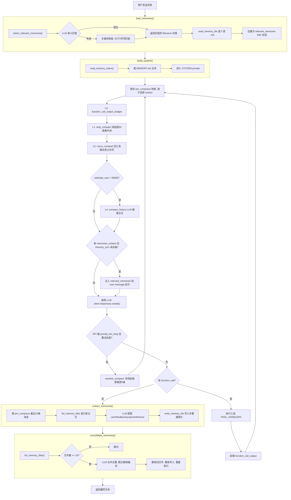

# Day 17 学习记录

## 1. 今天学习的文件

- `s09_memory/code_openai.py` -- 跨会话记忆系统

## 2. 核心概念

**短期上下文 vs 长期记忆：**

| | 短期上下文 | 长期记忆 |
|---|---|---|
| 存储位置 | `messages` 列表 | `.memory/` 目录 |
| 生命周期 | 会话结束后丢弃 | 跨会话持久化 |
| 容量管理 | L1-L4 压缩管线 | 索引 ≤200 行，≥10 条时触发 consolidation |
| 注入方式 | 始终在请求中 | 索引注入 SYSTEM prompt，详情按需 `load_memories()` 注入 |

**长期记忆的 4 种子类型**（`MEMORY_TYPES = ["user", "feedback", "project", "reference"]`）：

| 类型 | 含义 | 示例 |
|---|---|---|
| `user` | 用户偏好 | "喜欢用 tab 缩进" |
| `project` | 项目事实 | "技术栈 Python 3.12、入口 main.py" |
| `feedback` | 纠偏指导 | "不要用 pandas，用 polars" |
| `reference` | 外部引用 | "API 文档地址" |

**记忆系统不是保存过程 -- 它保存的是偏好、约束和项目事实。** 过程信息由短期上下文（`messages`）承担。

## 3. 关键代码

> 以下源码全部来自 [s09_memory/code_openai.py](file:///Users/james/Desktop/learn-claude-code/s09_memory/code_openai.py)

### 3.1 存储层：文件读写 + 索引重建

```python
# [code_openai.py#L88]
MEMORY_TYPES = ["user", "feedback", "project", "reference"]


def _parse_frontmatter(text: str) -> tuple[dict, str]:
    """解析 YAML frontmatter：提取元数据字典和正文内容。"""
    if not text.startswith("---"):
        return {}, text
    parts = text.split("---", 2)
    if len(parts) < 3:
        return {}, text
    meta = {}
    for line in parts[1].strip().splitlines():
        if ":" in line:
            k, v = line.split(":", 1)
            k = k.strip().strip('"').strip("'")
            v = v.strip().strip('"').strip("'")
            meta[k] = v
    return meta, parts[2].strip()


def write_memory_file(name: str, mem_type: str, description: str, body: str):
    """写入单个记忆文件（YAML frontmatter + Markdown 正文），写完后重建索引。"""
    slug = name.lower().replace(" ", "-").replace("/", "-")
    filename = f"{slug}.md"
    filepath = MEMORY_DIR / filename
    filepath.write_text(
        f"---\nname: {name}\ndescription: {description}\ntype: {mem_type}\n---\n\n{body}\n",
        encoding="utf-8",
    )
    _rebuild_index()
    return filepath


def _rebuild_index():
    """从所有记忆文件重建 MEMORY.md 索引，生成文件名+描述的行列表。"""
    lines = []
    for f in sorted(MEMORY_DIR.glob("*.md")):
        if f.name == "MEMORY.md":
            continue
        raw = f.read_text(encoding="utf-8")
        meta, body = _parse_frontmatter(raw)
        name = meta.get("name", f.stem)
        desc = meta.get("description", body.split("\n")[0][:80])
        lines.append(f"- [{name}]({f.name}) - {desc}")
    MEMORY_INDEX.write_text("\n".join(lines) + "\n" if lines else "", encoding="utf-8")


def read_memory_index() -> str:
    """读取 MEMORY.md 索引内容，每轮都会注入到 SYSTEM prompt 中。"""
    if not MEMORY_INDEX.exists():
        return ""
    text = MEMORY_INDEX.read_text(encoding="utf-8").strip()
    return text if text else ""


def read_memory_file(filename: str) -> str | None:
    """读取单个记忆文件的完整内容（含 frontmatter）。"""
    path = MEMORY_DIR / filename
    if not path.exists():
        return None
    return path.read_text(encoding="utf-8")


def list_memory_files() -> list[dict]:
    """列出所有记忆文件及其元数据（文件名、名称、描述、类型、正文）。"""
    result = []
    for f in sorted(MEMORY_DIR.glob("*.md")):
        if f.name == "MEMORY.md":
            continue
        raw = f.read_text(encoding="utf-8")
        meta, body = _parse_frontmatter(raw)
        result.append(
            {
                "filename": f.name,
                "name": meta.get("name", f.stem),
                "description": meta.get("description", ""),
                "type": meta.get("type", "user"),
                "body": body,
            }
        )
    return result
```

### 3.2 记忆选择与加载：`select_relevant_memories` + `load_memories`

```python
def select_relevant_memories(messages: list, max_items: int = 5) -> list[str]:
    """选择与最近对话相关的记忆文件。优先用 LLM 匹配，失败时降级为关键词匹配。"""
    files = list_memory_files()
    if not files:
        return []

    # 收集最近 3 条用户消息文本
    recent_texts = []
    for msg in reversed(messages):
        if msg.get("role") == "user":
            content = msg.get("content", "")
            if isinstance(content, list):
                content = extract_text(content)
            if isinstance(content, str):
                recent_texts.append(content)
            if len(recent_texts) >= 3:
                break
    recent = " ".join(reversed(recent_texts))[:2000]

    if not recent.strip():
        return []

    # 构建记忆目录
    catalog_lines = []
    for i, f in enumerate(files):
        catalog_lines.append(f"{i}: {f['name']} - {f['description']}")
    catalog = "\n".join(catalog_lines)

    prompt = (
        "Given the recent conversation and the memory catalog below, "
        "select the indices of memories that are clearly relevant. "
        "Return ONLY a JSON array of integers, e.g. [0, 3]. "
        "If none are relevant, return [].\n\n"
        f"Recent conversation:\n{recent}\n\n"
        f"Memory catalog:\n{catalog}"
    )

    try:
        response = client.responses.create(
            model=MODEL,
            input=[{"role": "user", "content": prompt}],
            max_output_tokens=200,
        )
        text = extract_text(response.output).strip()
        match = re.search(r"\[.*?\]", text, re.DOTALL)
        if match:
            indices = json.loads(match.group())
            selected = []
            for idx in indices:
                if isinstance(idx, int) and 0 <= idx < len(files):
                    selected.append(files[idx]["filename"])
                    if len(selected) >= max_items:
                        break
            return selected
    except Exception:
        pass

    # Fallback: 关键词匹配 -- 过滤掉长度小于 4 的关键词
    keywords = [w.lower() for w in recent.split() if len(w) > 3]
    selected = []
    for f in files:
        text = (f["name"] + " " + f["description"]).lower()
        if any(kw in text for kw in keywords):
            selected.append(f["filename"])
            if len(selected) >= max_items:
                break
    return selected


def load_memories(messages: list) -> str:
    """加载与当前对话相关的记忆内容，包裹在 <relevant_memories> 标签中注入上下文。"""
    selected_files = select_relevant_memories(messages)
    if not selected_files:
        return ""

    parts = ["<relevant_memories>"]
    for filename in selected_files:
        content = read_memory_file(filename)
        if content:
            parts.append(content)
    parts.append("</relevant_memories>")
    return "\n\n".join(parts)
```

### 3.3 记忆提取与合并：`extract_memories` + `consolidate_memories`

```python
def extract_memories(messages: list):
    """从最近对话中提取新的记忆（偏好、约束、项目事实等），写入记忆文件。每轮结束后触发。"""
    # 取最近 10 条消息
    dialogue_parts = []
    for msg in messages[-10:]:
        role = msg.get("role", "?")
        content = msg.get("content", "")
        if isinstance(content, list):
            content = extract_text(content)
        if isinstance(content, str) and content.strip():
            dialogue_parts.append(f"{role}: {content}")
    dialogue = "\n".join(dialogue_parts)

    if not dialogue.strip():
        return

    # 查已有记忆，防止重复提取
    existing = list_memory_files()
    existing_desc = (
        "\n".join(f"- {m['name']}: {m['description']}" for m in existing)
        if existing
        else "(none)"
    )

    prompt = (
        "Extract user preferences, constraints, or project facts from this dialogue.\n"
        "Return a JSON array. Each item: {name, type, description, body}.\n"
        "- name: short kebab-case identifier (e.g. 'user-preference-tabs')\n"
        "- type: one of 'user' (user preference), 'feedback' (guidance), "
        "'project' (project fact), 'reference' (external pointer)\n"
        "- description: one-line summary for index lookup\n"
        "- body: full detail in markdown\n"
        "If nothing new or already covered by existing memories, return [].\n\n"
        f"Existing memories:\n{existing_desc}\n\n"
        f"Dialogue:\n{dialogue[:4000]}"
    )

    try:
        response = client.responses.create(
            model=MODEL,
            input=[{"role": "user", "content": prompt}],
            max_output_tokens=800,
        )
        text = extract_text(response.output).strip()
        match = re.search(r"\[.*\]", text, re.DOTALL)
        if not match:
            return
        items = json.loads(match.group())
        if not items:
            return
        count = 0
        for mem in items:
            name = mem.get("name", f"memory_{int(time.time())}")
            mem_type = mem.get("type", "user")
            desc = mem.get("description", "")
            body = mem.get("body", "")
            if desc and body:
                write_memory_file(name, mem_type, desc, body)
                count += 1
        if count:
            print(f"\n\033[33m[Memory: extracted {count} new memories]\033[0m")
    except Exception:
        pass


CONSOLIDATE_THRESHOLD = 10


def consolidate_memories():
    """合并/整理记忆：当记忆文件数 >= 阈值时，删重、去过期、合并到 30 条以内。"""
    files = list_memory_files()
    if len(files) < CONSOLIDATE_THRESHOLD:
        return

    catalog = "\n\n".join(
        f"## {f['filename']}\nname: {f['name']}\ndescription: {f['description']}\n{f['body']}"
        for f in files
    )

    prompt = (
        "Consolidate the following memory files. Rules:\n"
        "1. Merge duplicates into one\n"
        "2. Remove outdated/contradicted memories\n"
        "3. Keep the total under 30 memories\n"
        "4. Preserve important user preferences above all\n"
        "Return a JSON array. Each item: {name, type, description, body}.\n\n"
        f"{catalog[:16000]}"
    )

    try:
        response = client.responses.create(
            model=MODEL,
            input=[{"role": "user", "content": prompt}],
            max_output_tokens=3000,
        )
        text = extract_text(response.output).strip()
        match = re.search(r"\[.*\]", text, re.DOTALL)
        if not match:
            return
        items = json.loads(match.group())

        # 删除所有旧记忆文件（保留 MEMORY.md）
        for f in MEMORY_DIR.glob("*.md"):
            if f.name != "MEMORY.md":
                f.unlink()

        for mem in items:
            name = mem.get("name", f"memory_{int(time.time())}")
            mem_type = mem.get("type", "user")
            desc = mem.get("description", "")
            body = mem.get("body", "")
            if desc and body:
                write_memory_file(name, mem_type, desc, body)

        print(
            f"\n\033[33m[Memory: consolidated {len(files)} -> {len(items)} memories]\033[0m"
        )
    except Exception:
        pass
```

### 3.4 注入点：`build_system` + `agent_loop`

```python
def build_system() -> str:
    """构建 SYSTEM prompt：包含工作目录和记忆索引，提示 LLM 遵循用户偏好。"""
    index = read_memory_index()
    memories_section = f"\n\nMemories available:\n{index}" if index else ""
    return (
        f"You are a coding agent at {WORKDIR}."
        f"{memories_section}\n"
        "Relevant memories are injected below. Respect user preferences from memory.\n"
        "When the user says 'remember' or expresses a clear preference, acknowledge it briefly. "
        "The program will extract it as a memory after the turn."
    )


MAX_REACTIVE_RETRIES = 1


def agent_loop(messages: list):
    """s09 主循环：注入记忆 -> 压缩管线 -> 调用 LLM -> 执行工具 -> 提取新记忆。"""
    reactive_retries = 0
    # 入口：选择相关记忆，包裹为 XML 块
    memories_content = load_memories(messages)
    # 记录最近一次注入记忆的轮次，避免重复注入到已被 snip 裁掉的消息
    memory_turn = (
        len(messages) - 1
        if messages and isinstance(messages[-1].get("content"), str)
        else None
    )
    system = build_system()

    while True:
        # 保存压缩前快照，用于后续 extract 时保持信息完整
        pre_compress = [
            (
                m
                if isinstance(m, dict)
                else {"role": m.get("role", ""), "content": str(m.get("content", ""))}
            )
            for m in messages
        ]

        # 四层压缩管线（L3 -> L1 -> L2，必要时 L4）
        messages[:] = function_call_output_budget(messages)
        messages[:] = snip_compact(messages)
        messages[:] = micro_compact(messages)

        if estimate_size(messages) > CONTEXT_LIMIT:
            messages[:] = compact_history(messages)

        try:
            # 注入记忆：仅当有记忆内容、目标消息存在且未被 snip 裁掉时才注入
            request_messages = messages
            if (
                memories_content
                and memory_turn is not None
                and memory_turn < len(messages)
            ):
                request_messages = messages.copy()
                request_messages[memory_turn] = {
                    **messages[memory_turn],
                    "content": memories_content
                    + "\n\n"
                    + messages[memory_turn]["content"],
                }

            # 调用 LLM
            response = client.responses.create(
                model=MODEL,
                instructions=system,
                input=request_messages,
                tools=TOOLS,
                max_output_tokens=8000,
            )
            reactive_retries = 0
        except Exception as e:
            # prompt_too_long -> reactive_compact 应急压缩，最多重试 1 次
            if (
                "prompt_too_long" in str(e).lower()
                or "too many tokens" in str(e).lower()
            ) and reactive_retries < MAX_REACTIVE_RETRIES:
                print("[reactive compact]")
                messages[:] = reactive_compact(messages)
                reactive_retries += 1
                continue
            raise

        messages.extend(as_input_item(item) for item in response.output)

        # 无 function_call = 本轮结束 -> 提取记忆
        if not function_calls(response):
            extract_memories(pre_compress)    # 从压缩前快照提取，保证完整
            consolidate_memories()             # >=10 条时合并去重
            return extract_text(response.output)

        # 执行工具 -> 回填 function_call_output -> 下一轮循环
        results = []
        for block in function_calls(response):
            if block.type != "function_call":
                continue
            print(f"\033[36m> {block.name}\033[0m")
            handler = TOOL_HANDLERS.get(block.name)
            output = (
                handler(**call_args(block)) if handler else f"Unknown: {block.name}"
            )
            print(str(output)[:200])
            results.append(
                {
                    "type": "function_call_output",
                    "call_id": block.call_id,
                    "output": output,
                }
            )
        messages.extend(results)
```

## 4. 我理解的流程



## 5. 仍然不清楚的问题

- `consolidate_memories` 的触发时机：代码中在 `extract_memories` 之后立即调用，但没有频率限制。如果每轮结束都 extract + consolidate，会不会过于频繁？

## 6. 明天要验证的点

- `s10_system_prompt/code.py` 中 system prompt 的构造逻辑，以及动态/静态策略的区分
