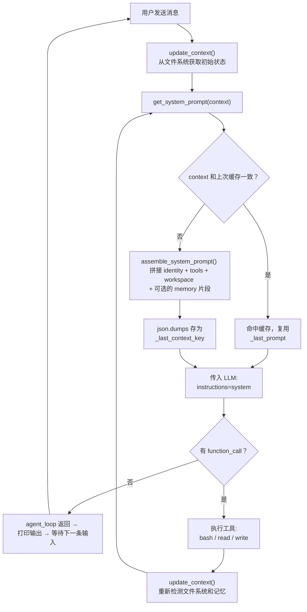

# Day 18 学习记录

## 1. 今天学习的文件

- `s10_system_prompt/code.py` -- Anthropic 版本
- `s10_system_prompt/code_openai.py` -- OpenAI 版本

## 2. 核心概念

**从硬编码 SYSTEM 到运行时动态拼装：**

| | s09 之前 | s10 |
|---|---|---|
| system prompt | 写死的常量字符串 | 运行时根据 context 动态拼接 |
| 变更检测 | 无（每次都重建） | `json.dumps` 缓存，context 不变则复用 |
| 条件加载 | 不支持 | 有记忆文件时追加 memory 片段 |
| 职责 | 一条字符串 | `PROMPT_SECTIONS`（模板） + `context`（决策数据）分离 |

**两套数据的分工：**

| | `PROMPT_SECTIONS` | `context` |
|---|---|---|
| 作用 | prompt 模板片段（静态文案） | 运行时状态快照（动态数据） |
| 内容 | `"You are a coding agent..."` 等固定文案 | `{enabled_tools, workspace, memories}` |
| 变化 | 不改 | 每轮工具调用后刷新 |
| 用途 | `assemble_system_prompt` 从中取片段 | `json.dumps` 序列化后做缓存 key |

## 3. 关键代码

> 以下源码主要来自 [s10_system_prompt/code_openai.py](file:///Users/james/Desktop/learn-claude-code/s10_system_prompt/code_openai.py)，Anthropic 版本逻辑相同，仅 API 调用方式不同。

### 3.1 Prompt 片段定义

```python
# [code_openai.py#L62-67]
PROMPT_SECTIONS = {
    "identity": "You are a coding agent. Act, don't explain.",
    "tools": "Available tools: bash, read_file, write_file.",
    "workspace": f"Working directory: {WORKDIR}",
    "memory": "Relevant memories are injected below when available.",
}
```

### 3.2 拼装：`assemble_system_prompt`

```python
def assemble_system_prompt(context: dict) -> str:
    """根据当前上下文选择并拼接 prompt 片段。始终加载 identity/tools/workspace，有记忆时追加 memory。"""
    sections = []

    # 始终加载
    sections.append(PROMPT_SECTIONS["identity"])
    sections.append(PROMPT_SECTIONS["tools"])
    sections.append(PROMPT_SECTIONS["workspace"])

    # 条件加载：有记忆文件时追加
    memories = context.get("memories", "")
    if memories:
        sections.append(f"Relevant memories:\n{memories}")

    return "\n\n".join(sections)
```

最终拼接结果示例：

```
You are a coding agent. Act, don't explain.

Available tools: bash, read_file, write_file.

Working directory: d:\study\learn-claude-code

Relevant memories:
- [user-preference-tabs](user-preference-tabs.md) - 喜欢用 tab 缩进
```

### 3.3 缓存：`get_system_prompt`

```python
_last_context_key = None
_last_prompt = None

def get_system_prompt(context: dict) -> str:
    """缓存包装：context 未变时复用上次拼装结果，避免重复字符串拼接。"""
    global _last_context_key, _last_prompt
    # sort_keys=True   → 按 key 排序输出，保证相同 dict 始终生成相同字符串
    # ensure_ascii=False → 中文等非 ASCII 字符原样保留，不转义为 \uXXXX
    # default=str       → 遇到无法序列化的类型（如 Path、set）时调用 str() 兜底
    key = json.dumps(context, sort_keys=True, ensure_ascii=False, default=str)
    if key == _last_context_key and _last_prompt:
        print("  [cache hit] system prompt unchanged")
        return _last_prompt
    _last_context_key = key
    _last_prompt = assemble_system_prompt(context)
    return _last_prompt
```

用 `json.dumps` 而不用 Python 内置 `hash()` 的原因：
- `hash()` 有进程随机性（每次启动值不同），无法跨进程对比
- `hash()` 不能直接对 `dict`/`list` 取 hash
- `json.dumps` + `sort_keys=True` 保证相同数据永远生成相同字符串

### 3.4 上下文派生：`update_context`

```python
def update_context(context: dict, messages: list) -> dict:
    """从真实状态派生上下文：当前启用的工具列表、工作目录、是否加载了记忆文件。"""
    memories = ""
    if MEMORY_INDEX.exists():
        content = MEMORY_INDEX.read_text().strip()
        if content:
            memories = content
    return {
        "enabled_tools": list(TOOL_HANDLERS.keys()),
        "workspace": str(WORKDIR),
        "memories": memories,
    }
```

注意：s10 中 `context` 和 `messages` 两个参数目前未使用——函数只读文件系统和模块全局变量。这是为后续章节预留的签名，后续会利用 `messages` 分析对话状态来决定加载哪些 prompt 片段。

### 3.5 主循环中的调用

```python
def agent_loop(messages: list, context: dict):
    """主循环：用拼装的 system prompt 替代硬编码的 SYSTEM，每次工具调用后重新评估 context。"""
    system = get_system_prompt(context)
    while True:
        response = client.responses.create(
            model=MODEL, instructions=system, input=messages,
            tools=TOOLS, max_output_tokens=8000)

        # ... 处理响应 ...

        # 每轮工具调用后重新评估 context 和 prompt
        context = update_context(context, messages)
        system = get_system_prompt(context)
```

如果工具调用过程中创建了新的记忆文件，下一轮 `update_context` 会检测到，`get_system_prompt` 检测到 context 变化后重新拼装，追加 memory 片段。

### 3.6 Anthropic vs OpenAI 差异

| | Anthropic (`code.py`) | OpenAI (`code_openai.py`) |
|---|---|---|
| 传 system prompt | `client.messages.create(system=system, ...)` | `client.responses.create(instructions=system, ...)` |
| 参数名 | `system` | `instructions` |
| 检测 tool call | `response.stop_reason != "tool_use"` | `function_calls(response)` 返回值判断 |
| content 类型 | `block.type == "text"` | `block.type == "output_text"` |

## 4. 我理解的流程



## 5. 仍然不清楚的问题

- `get_system_prompt` 的缓存只在进程内有效。如果真实 Claude Code 在 API 层面也做了 prompt cache（如 Anthropic 的 `cache_control`），这个进程级缓存是否还有必要？两者各解决什么问题？

## 6. 明天要验证的点

- `s11` 中 context 和 messages 参数是否开始被实际使用，用于更复杂的 prompt 片段选择逻辑
