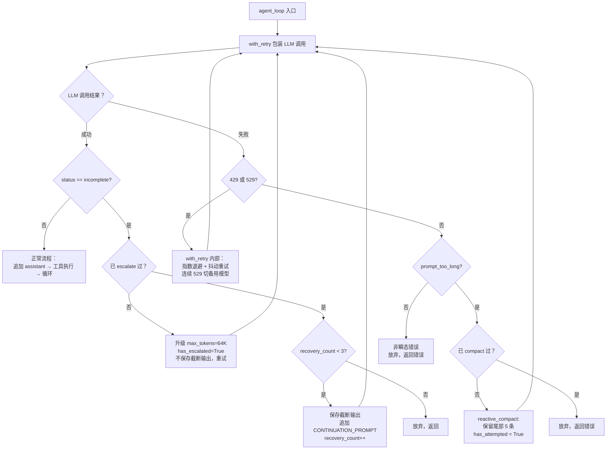

# Day 19 学习记录

## 1. 今天学习的文件

- `s11_error_recovery/code_openai.py` -- 三层错误恢复机制

## 2. 核心概念

**错误恢复不是"吞掉错误"，而是给系统自愈的能力。**

| 错误类型 | 恢复策略 | 最多重试 | 原理 |
|---|---|---|---|
| `max_output_tokens` (输出被截断) | 升级 8K→64K → continuation prompt | escalate 1 次 + continue 3 次 | 给更多空间，还不够就让模型接着写 |
| `prompt_too_long` (输入过长) | reactive compact → 重试 | 1 次 | 裁剪旧消息，只保留尾部 |
| `429` (限流) | 指数退避 + 随机抖动 | 10 次 | 等服务器恢复 |
| `529` (过载) | 指数退避 + 连续 3 次切备用模型 | 10 次 | 等服务器恢复，不行就换模型 |
| 其他错误 | 记日志，返回错误消息 | 0 | 非瞬态，不重试 |

**关键设计原则**：
- 错误分"瞬态"和"非瞬态"——429/529 可能自己恢复，可以重试；`prompt_too_long` 不会自己好，需要主动压缩
- `RecoveryState` 跨循环跟踪状态，防止无限重试（escalate 只一次，compact 只一次）
- jitter 防止惊群效应（thundering herd）

**按来源位置的错误三层分类**：

| 错误类型 | 来源 | 示例 | s11 是否处理 |
|---|---|---|---|
| **工具错误** | 工具执行层 | bash 返回非零退出码、read_file 找不到文件、write_file 权限不足 | 未处理 — 工具抛异常会直接崩溃 |
| **模型错误** | LLM API 层 | 429 限流、529 过载、token 超限、prompt 过长 | 全部覆盖 — with_retry + escalate + compact |
| **流程错误** | Agent 行为层 | LLM 调用错误的工具、陷入死循环、输出格式不符合预期 | 未处理 — 需要更高层（如 s12 的 TodoWrite）来约束行为 |

s11 的错误恢复专注于**模型错误**（API 层），因为这是最不可预测且系统有能力自愈的层级。工具错误和流程错误属于不同层级的问题，需要在对应层分别处理。

## 3. 关键代码

> 以下源码来自 [s11_error_recovery/code_openai.py](file:///Users/james/Desktop/learn-claude-code/s11_error_recovery/code_openai.py)

### 3.1 恢复状态追踪：`RecoveryState`

```python
class RecoveryState:
    """跟踪错误恢复状态：是否已升级 token、已执行 reactive compact、连续 529 次数、当前模型。"""
    def __init__(self):
        self.has_escalated = False                  # 只允许升级 token 一次
        self.recovery_count = 0                     # continuation prompt 次数
        self.consecutive_529 = 0                    # 连续 529 计数器
        self.has_attempted_reactive_compact = False # 只允许 compact 一次
        self.current_model = PRIMARY_MODEL           # 当前使用的模型（切备胎后会变）
```

### 3.2 指数退避 + 抖动：`retry_delay`

```python
def retry_delay(attempt, retry_after=None):
    """指数退避 + 随机抖动，避免惊群效应。如果有 Retry-After 头则直接使用。"""
    if retry_after:
        return retry_after
    base = min(BASE_DELAY_MS * (2 ** attempt), 32000) / 1000  # 0.5s → 1s → 2s → ... 封顶 32s
    jitter = random.uniform(0, base * 0.25)                    # [0, base*25%] 随机抖动
    return base + jitter
```

为什么需要 jitter？假设 1000 个客户端同时遇到 429，没有抖动就全部等 2s 后同时重试 → 服务器又炸（惊群效应）。加上随机抖动后请求分散在 2s~2.5s 之间，压力平滑。

### 3.3 重试包装器：`with_retry`

```python
def with_retry(fn, state: RecoveryState):
    """指数退避重试包装器。处理 429（限流）和 529（过载），连续 529 达阈值时切备用模型。"""
    for attempt in range(MAX_RETRIES):
        try:
            result = fn()
            state.consecutive_529 = 0
            return result
        except Exception as e:
            # 429 → 按 attempt 等指数退避
            if "ratelimit" in str(e).lower() or "429" in str(e):
                time.sleep(retry_delay(attempt))
                continue

            # 529 → 连续 3 次切 FALLBACK_MODEL
            if "overloaded" in str(e).lower() or "529" in str(e):
                state.consecutive_529 += 1
                if state.consecutive_529 >= 3 and FALLBACK_MODEL:
                    state.current_model = FALLBACK_MODEL
                time.sleep(retry_delay(attempt))
                continue

            # 非瞬态 → 向外层抛出
            raise
```

关键点：只重试**瞬态**错误（429/529 过一会儿可能恢复），非瞬态错误直接向外抛给 `agent_loop` 的 try/except 处理。

### 3.4 错误分类器：`is_prompt_too_long_error`

```python
def is_prompt_too_long_error(e: Exception) -> bool:
    """判断 API 错误是否为 prompt/上下文过长（关键词匹配）。"""
    msg = str(e).lower()
    return ("prompt_too_long" in msg        # Anthropic
            or "context_length_exceeded" in msg  # OpenAI
            or ("prompt" in msg and "long" in msg))
```

用关键词匹配而不是错误码——不同 API 的报错格式不统一，关键词匹配更通用。

### 3.5 Path 1：max_tokens 恢复

```python
# 第一阶段：首次触发 → 升级 8K → 64K，不保存截断输出，直接重试
if not state.has_escalated:
    max_tokens = ESCALATED_MAX_TOKENS  # 64000
    state.has_escalated = True
    continue  # ← 同一请求用更大 token 上限重来

# 第二阶段：64K 还是不够 → 保存已输出 + 追加续写提示
messages.extend(as_input_item(item) for item in response.output)
if state.recovery_count < MAX_RECOVERY_RETRIES:  # 最多 3 次
    messages.append({"role": "user", "content": CONTINUATION_PROMPT})
    continue
```

`CONTINUATION_PROMPT = "Output token limit hit. Resume directly — no apology, no recap. Pick up mid-thought."`

### 3.6 Path 2：prompt_too_long 恢复

```python
except Exception as e:
    if is_prompt_too_long_error(e):
        if not state.has_attempted_reactive_compact:
            messages[:] = reactive_compact(messages)  # 只保留尾部 5 条
            state.has_attempted_reactive_compact = True
            continue
        # compact 后还是太长 → 放弃
        return
```

### 3.7 reactive_compact

```python
def reactive_compact(messages: list) -> list:
    """应急压缩：保留尾部 5 条消息。真 CC 会用 LLM 生成摘要，教学版直接裁剪。"""
    tail = messages[-5:]
    return [{"role": "user",
             "content": "[Reactive compact] Earlier conversation trimmed. "
                        "Continue from where you left off."}, *tail]
```

### 3.8 agent_loop 中的使用

```python
def agent_loop(messages: list, context: dict):
    while True:
        try:
            # with_retry 自动处理 429/529
            response = with_retry(lambda: client.responses.create(...), state)
        except Exception as e:
            # with_retry 抛出的非瞬态错误 → Path 2 检查 prompt_too_long
            if is_prompt_too_long_error(e):
                messages[:] = reactive_compact(messages)
                continue
            return  # 不可恢复

        # Path 1: 正常响应但被截断
        if response.status == "incomplete":
            # escalate → continue prompt 逻辑
            ...

        # 正常流程
        ...
```

### 3.9 工具错误：未被处理的盲区

```python
# ── Tool execution ──               # [code_openai.py#L383-401]
results = []
for block in function_calls(response):
    handler = TOOL_HANDLERS.get(block.name)
    output = (
        handler(**call_args(block)) if handler else f"Unknown: {block.name}"
    )
    results.append({"type": "function_call_output", ...})
messages.extend(results)
```

工具执行段没有任何 try/except 包裹。如果 `run_bash` 内部的命令返回非零退出码、`run_read` 遇到权限问题、`run_write` 磁盘满——这些都会直接抛出异常，绕过 agent_loop 的所有错误恢复逻辑，导致程序崩溃。

真实 Claude Code 如何处理工具错误：
- bash 非零退出码：不作为异常抛出，而是把 stderr + exit code 作为 tool output 返回给 LLM，让 LLM 自己判断是否重试
- 文件操作错误：同样返回错误消息给 LLM，不中断循环

s11 教学版简化了这一点，聚焦于 API 层的恢复。

## 4. 我理解的流程



## 5. 仍然不清楚的问题

- `with_retry` 的 `fn` 参数为什么用 `lambda` 包一层？直接传 `client.responses.create` 不行吗？——因为需要捕获 `max_tokens` 和 `state.current_model` 的当前值，`lambda` 形成了闭包。
- 恢复策略全部自动执行，是否合理？
  - `reactive_compact` 直接丢弃历史消息，LLM 丢失上下文后可能给出不一致的回答——是否应该先询问用户 "对话太长，是否允许压缩？"
  - 连续 529 自动切备用模型——备用模型的行为/能力可能与主模型不同，用户是否应该知情？
  - `max_tokens` 的 continuation prompt 让 LLM 接着写，但截断位置可能正好在代码中间——LLM 能否正确续写？
  - 什么情况下自动恢复应该**放弃**并交给用户决策？当前的设计以恢复次数为唯一上限，没有考虑"恢复代价"（如丢失上下文）

## 6. 明天要验证的点

- `s12_task_system` 中任务系统的设计，以及 todo 工具的实现

## 7. 总结：错误恢复 vs 普通异常处理

| | 普通异常处理 | 错误恢复 |
|---|---|---|
| **目标** | 阻止崩溃，优雅退出 | 系统自愈，继续执行 |
| **触发条件** | 任何异常 | 仅限可自动修复的错误 |
| **处理方式** | `try/except` → 记日志 → 退出/返回错误 | 分类 → 干预 → 重试 |
| **用户感知** | 用户看到错误，需要手动重试 | 用户无感知（429/529/escalate）或最低限度感知（compact 警告） |
| **关键区别** | "这个错误我处理不了" | "这个错误我能修好" |

**两条核心判断线**：

```
错误发生
  │
  ├── 是瞬态错误（过一会儿可能恢复）？
  │     └── 是 → 自动重试（指数退避 + 抖动）
  │           例：429 限流、529 过载
  │
  ├── 系统能通过自身操作修复？
  │     └── 是 → 自动干预 → 重试
  │           例：max_tokens → 升级上限；prompt_too_long → 压缩上下文
  │
  └── 以上都不是？
        └── 否 → 降级为普通异常处理
              例：API 认证失败、网络不可达、工具逻辑错误
```

**s11 的覆盖范围**：当前只覆盖了 API 层（模型错误），工具错误和流程错误属于后续迭代。真实 Claude Code 中还有个隐式的"代理层"——当模型错误恢复失败时，系统会生成一条错误消息注入对话，让 LLM 自己向用户解释发生了什么，这也是一种恢复手段。
