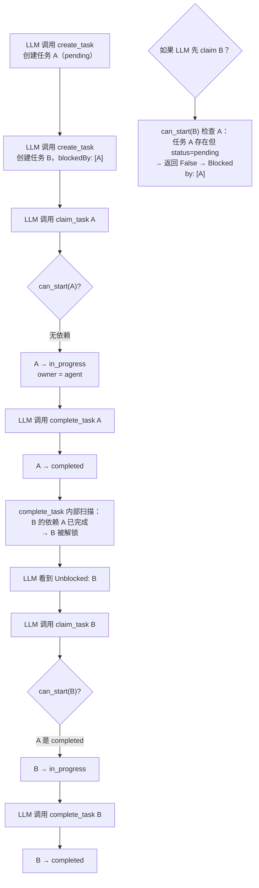

# Day 20 学习记录

## 1. 今天学习的文件

- `s12_task_system/code_openai.py` -- 基于文件持久化的任务图系统

## 2. 核心概念

**任务系统 = 有依赖关系的有向无环图（DAG）+ 文件持久化 + LLM 可操作的工具接口。**

s12 实现了 Claude Code 中 `TodoWrite` 工具背后的核心数据结构：任务有状态流转（pending → in_progress → completed），支持 `blockedBy` 前置依赖，所有任务以 JSON 文件持久化到 `.tasks/` 目录。

| 概念 | 说明 |
|---|---|
| Task 数据类 | `id`, `subject`, `description`, `status`, `owner`, `blockedBy` 六个字段 |
| 持久化 | 每个任务存为 `.tasks/<id>.json`，`asdict()` 序列化 / `**json.loads()` 反序列化 |
| 状态机 | `pending` →（claim）→ `in_progress` →（complete）→ `completed` |
| 依赖检查 | `can_start()` 遍历 `blockedBy`，所有依赖必须存在且为 `completed` 才可开始 |
| 级联解锁 | `complete_task` 完成任务后扫描所有 pending 任务，报告哪些下游依赖被解除 |
| 工具注册 | 5 个新工具注册到 `TOOLS` + `TOOL_HANDLERS`，LLM 可直接调用 |
| 简化设计 | 不含 s11 的错误恢复，专注于任务系统本身的数据结构和工作流 |

## 3. 关键代码

> 以下源码来自 [s12_task_system/code_openai.py](file:///d:/study/learn-claude-code/s12_task_system/code_openai.py)

### 3.1 任务数据类：`Task`

```python
@dataclass
class Task:
    """任务数据类：id、标题、描述、状态、负责人、前置依赖。持久化为 .tasks/<id>.json。"""
    id: str
    subject: str
    description: str
    status: str              # pending | in_progress | completed
    owner: str | None        # 负责人（多 Agent 场景）
    blockedBy: list[str]     # 前置依赖的任务 ID 列表
```

`@dataclass` 自动生成 `__init__`、`__repr__`、`__eq__` 等方法，配合 `asdict()` 和 `**json.loads()` 实现与 JSON 的无缝互转。

### 3.2 创建与持久化

```python
TASKS_DIR = WORKDIR / ".tasks"

def _task_path(task_id: str) -> Path:
    return TASKS_DIR / f"{task_id}.json"

def create_task(subject: str, description: str = "", blockedBy=None) -> Task:
    task = Task(
        id=f"task_{int(time.time())}_{random.randint(0, 9999):04d}",  # 时间戳 + 4位随机数
        subject=subject, description=description,
        status="pending", owner=None,
        blockedBy=blockedBy or [],
    )
    save_task(task)
    return task

def save_task(task: Task):
    _task_path(task.id).write_text(json.dumps(asdict(task), indent=2))
```

ID 生成策略：`task_<时间戳>_<4位随机数>` — 简单但实用，时间戳保证大致有序，随机数避免同秒冲突。

### 3.3 读取与列表

```python
def load_task(task_id: str) -> Task:
    return Task(**json.loads(_task_path(task_id).read_text()))

def list_tasks() -> list[Task]:
    return [Task(**json.loads(p.read_text())) for p in sorted(TASKS_DIR.glob("task_*.json"))]

def get_task(task_id: str) -> str:
    task = load_task(task_id)
    return json.dumps(asdict(task), indent=2)
```

`Task(**json.loads(...))` 是核心转换模式：JSON 反序列化得到 dict，`**` 解包传给 Task 构造函数。`get_task` 返回格式化 JSON 字符串，方便 LLM 阅读完整详情。

### 3.4 依赖检查：`can_start`

```python
def can_start(task_id: str) -> bool:
    """检查任务的所有 blockedBy 依赖是否已完成。依赖文件不存在也视为阻塞。"""
    task = load_task(task_id)
    for dep_id in task.blockedBy:
        if not _task_path(dep_id).exists():       # 依赖文件不存在 → 阻塞
            return False
        if load_task(dep_id).status != "completed":  # 依赖未完成 → 阻塞
            return False
    return True
```

两种阻塞情况：1）依赖任务压根没创建（文件不存在）；2）依赖任务存在但状态不是 `completed`。

### 3.5 任务认领：`claim_task`

```python
def claim_task(task_id: str, owner: str = "agent") -> str:
    task = load_task(task_id)
    if task.status != "pending":
        return f"Task {task_id} is {task.status}, cannot claim"
    if not can_start(task_id):
        deps = [d for d in task.blockedBy
                if not _task_path(d).exists() or load_task(d).status != "completed"]
        return f"Blocked by: {deps}"
    task.owner = owner
    task.status = "in_progress"
    save_task(task)
    return f"Claimed {task.id} ({task.subject})"
```

认领有两个前置条件：1）状态为 `pending`；2）所有依赖已满足。不满足时返回阻塞原因。

### 3.6 任务完成 + 级联解锁：`complete_task`

```python
def complete_task(task_id: str) -> str:
    task = load_task(task_id)
    if task.status != "in_progress":
        return f"Task {task_id} is {task.status}, cannot complete"
    task.status = "completed"
    save_task(task)
    # 扫描所有 pending 任务，找出哪些依赖刚被满足
    unblocked = [t.subject for t in list_tasks()
                 if t.status == "pending" and t.blockedBy and can_start(t.id)]
    msg = f"Completed {task.id} ({task.subject})"
    if unblocked:
        msg += f"\nUnblocked: {', '.join(unblocked)}"
    return msg
```

完成一个任务后扫描全局：遍历所有 `pending` 且有依赖的任务，检查其 `can_start` 是否从 `False` 变成了 `True`。这实现了 DAG 中的级联解锁——A 完成后 B 被解锁，通知 LLM "现在可以处理 B 了"。

### 3.7 工具注册

```python
TOOLS = [
    # ... bash, read_file, write_file ...
    {
        "type": "function", "name": "create_task",
        "description": "Create a new task with optional blockedBy dependencies.",
        "parameters": {
            "type": "object",
            "properties": {
                "subject": {"type": "string"},
                "description": {"type": "string"},
                "blockedBy": {"type": "array", "items": {"type": "string"}},
            },
            "required": ["subject"],
        },
    },
    # list_tasks, get_task, claim_task, complete_task 同理 ...
]

TOOL_HANDLERS = {
    "bash": run_bash,
    "read_file": run_read,
    "write_file": run_write,
    "create_task": run_create_task,
    "list_tasks": run_list_tasks,
    "get_task": run_get_task,
    "claim_task": run_claim_task,
    "complete_task": run_complete_task,
}
```

5 个新工具的 tool wrapper（`run_create_task` 等）负责：
- 调用核心函数
- 格式化返回字符串给 LLM
- 打印彩色终端输出（`\033[34m[create]\033[0m` 蓝色创建、`\033[32m[complete]\033[0m` 绿色完成）

Tool wrapper 层分离了 "给 LLM 看的消息" 和 "终端打印的日志"——LLM 拿到的是结构化字符串，用户看到的是带颜色的提示。

### 3.8 主循环集成

```python
def agent_loop(messages: list, context: dict):
    system = get_system_prompt(context)
    while True:
        response = client.responses.create(
            model=MODEL, instructions=system, input=messages,
            tools=TOOLS, max_output_tokens=8000)

        messages.extend(as_input_item(item) for item in response.output)
        if not function_calls(response):
            return response

        results = []
        for block in function_calls(response):
            handler = TOOL_HANDLERS.get(block.name)
            output = handler(**call_args(block)) if handler else f"Unknown: {block.name}"
            results.append({"type": "function_call_output",
                            "call_id": block.call_id, "output": output})
        messages.extend(results)
        context = update_context(context, messages)
        system = get_system_prompt(context)
```

任务工具和其他工具（bash/read/write）在同一个循环中统一处理——`TOOL_HANDLERS` dict 按名称分发，新增工具只需加一条映射即可。

## 4. 我理解的流程



关键点：LLM 不需要理解 DAG 拓扑，只需要按 `claim_task` 返回的阻塞信息来决定下一步做什么。任务系统通过 "阻塞/解锁" 消息引导 LLM 按正确顺序执行。

## 5. 仍然不清楚的问题

- `complete_task` 扫描全局来发现被解锁的任务，复杂度 O(n)。真实 Claude Code 中任务数量可能很多，是否有更高效的实现方式（如维护反向依赖索引）？
- ID 生成用时间戳 + 随机数，在分布式多 Agent 场景下是否足够唯一？真实系统中是否用 UUID？
- 当 LLM 同时 claim 同一个任务时（并发），当前设计没有锁机制——真实系统如何处理竞态条件？

## 6. 明天要验证的点

- s13 或后续章节是否引入了更多任务系统增强，如超时、优先级、子任务等
