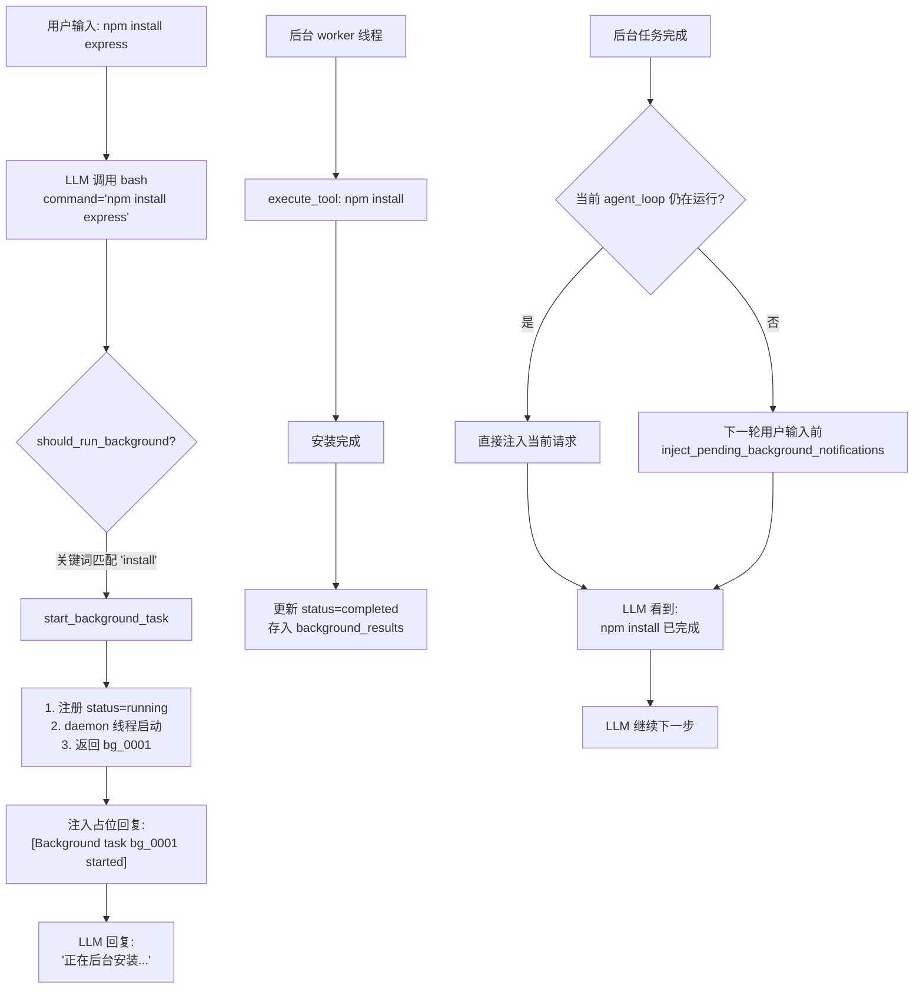

# Day 21 学习记录

## 1. 今天学习的文件

- `s13_background_tasks/code_openai.py` -- 基于线程的后台任务执行与通知注入

## 2. 核心概念

**后台任务 = daemon 线程 + 线程安全字典 + 分阶段通知注入。让 LLM 不必等待耗时命令。**

s13 在 s12 任务系统之上新增了 7 个核心模块，解决 LLM Agent 执行 `npm install` 等长耗时命令时的阻塞问题。命令在后台线程中执行，主循环继续运行；结果通过 `<task_notification>` XML 格式异步通知 LLM。

| 概念 | 说明 |
|---|---|
| daemon 线程 | `threading.Thread(target=worker, daemon=True)` — 主进程退出时自动被杀，不阻塞关闭 |
| 线程安全 | `threading.Lock()` 保护 `background_tasks` 和 `background_results` 两个共享 dict |
| 双重判断 | `should_run_background`: 模型显式指定 `run_in_background=true` 优先，否则用关键词启发式 |
| 启发式检测 | `is_slow_operation`: 匹配 `install`/`build`/`test`/`compile` 等慢命令关键词 |
| 占位回复 | 后台命令启动后立即返回占位文本 `[Background task bg_0001 started]`，不空等 |
| XML 通知格式 | `<task_notification>` 包含 `task_id`/`status`/`command`/`summary` 四个字段 |
| 通知注入 | 当前轮已完成的任务立即注入；仍在运行的任务缓存在 `pending_background_notifications` 中，下一轮用户输入前再注入 |

## 3. 关键代码

> 以下源码来自 [s13_background_tasks/code_openai.py](file:///d:/study/learn-claude-code/s13_background_tasks/code_openai.py)

### 3.1 共享状态与锁

```python
_bg_counter = 0
background_tasks: dict[str, dict] = {}   # bg_id → {call_id, command, status}
background_results: dict[str, str] = {}   # bg_id → output
pending_background_notifications: list[str] = []  # 跨轮延迟通知队列
background_lock = threading.Lock()
```

四块共享状态：
- `_bg_counter`：自增计数器，生成 `bg_0001` 格式 ID
- `background_tasks`：记录每个后台任务的生命周期（running → completed）
- `background_results`：存储执行结果文本
- `pending_background_notifications`：已收集但尚未注入的通知队列（跨 agent_loop 调用）

锁保护 dict 的结构完整性——两个线程同时修改同一个 dict 在 Python 中不是线程安全的。

### 3.2 启发式慢命令检测：`is_slow_operation`

```python
def is_slow_operation(tool_name: str, tool_input: dict) -> bool:
    if tool_name != "bash":
        return False
    cmd = tool_input.get("command", "").lower()
    slow_keywords = ["install", "build", "test", "deploy", "compile",
                     "docker build", "pip install", "npm install",
                     "cargo build", "pytest", "make"]
    return any(kw in cmd for kw in slow_keywords)
```

只对 `bash` 工具生效（read/write 等文件操作很快，不需要后台化）。通过关键词子串匹配判断——简单但有效，因为大多数慢命令都包含这些关键词。

### 3.3 双重判断：`should_run_background`

```python
def should_run_background(tool_name: str, tool_input: dict) -> bool:
    if tool_input.get("run_in_background"):
        return True
    return is_slow_operation(tool_name, tool_input)
```

两级决策：模型显式指定 `run_in_background=true` → 直接后台化；否则用启发式兜底。模型可能比关键词更了解意图（如 "这个安装包很大"），但关键词保证了即使模型没指定也能自动后台化。

### 3.4 后台任务启动：`start_background_task`

```python
def start_background_task(block) -> str:
    global _bg_counter
    _bg_counter += 1
    bg_id = f"bg_{_bg_counter:04d}"
    cmd = call_args(block).get("command", block.name)

    def worker():
        result = execute_tool(block)
        with background_lock:
            background_tasks[bg_id]["status"] = "completed"
            background_results[bg_id] = result

    with background_lock:
        background_tasks[bg_id] = {
            "call_id": block.call_id,
            "command": cmd,
            "status": "running",
        }
    thread = threading.Thread(target=worker, daemon=True)
    thread.start()
    return bg_id
```

关键时序：先用锁注册 `status="running"` 把坑挖好，再 `thread.start()` 启动 worker。顺序不能反过来——反过来的话 worker 中可能访问尚不存在的 `background_tasks[bg_id]`。

`worker` 是闭包函数，捕获了外层 `block` 和 `bg_id` 变量。在独立线程里调用 `execute_tool(block)` 执行实际命令，完成后用锁更新状态和结果。

### 3.5 结果收集：`collect_background_results`

```python
def collect_background_results() -> list[str]:
    with background_lock:
        ready_ids = [bid for bid, task in background_tasks.items()
                     if task["status"] == "completed"]
    notifications = []
    for bg_id in ready_ids:
        with background_lock:
            task = background_tasks.pop(bg_id)       # 取出并删除
            output = background_results.pop(bg_id, "")
        summary = output[:200] if len(output) > 200 else output
        notifications.append(
            f"<task_notification>\n"
            f"  <task_id>{bg_id}</task_id>\n"
            f"  <status>completed</status>\n"
            f"  <command>{task['command']}</command>\n"
            f"  <summary>{summary}</summary>\n"
            f"</task_notification>")
    return notifications
```

两次加锁分离"扫描"和"取出"，减少持锁时间。`pop()` 同时获取并删除，避免下次调用时重复收集同一个任务。输出截断到 200 字符，防止长输出撑爆 LLM 上下文。

### 3.6 后台通知注入：`inject_pending_background_notifications`

```python
def inject_pending_background_notifications(messages: list):
    # 每次用户输入前都先收集一轮
    bg_notifications = collect_background_results()
    if bg_notifications:
        pending_background_notifications.extend(bg_notifications)

    if not pending_background_notifications:
        return

    notification_text = "\n\n".join(pending_background_notifications)
    messages.append({"role": "user", "content": notification_text})
    pending_background_notifications.clear()
```

该函数负责处理上一轮结束后才完成的任务：每次用户输入前再次收集结果，将待发送通知作为纯文本 user 消息插入。对于已经在当前 `agent_loop` 末尾完成的任务，代码会直接把通知追加到当前请求，让模型在当前轮继续处理；只有尚未完成的任务才会进入 `pending_background_notifications`，等待下一轮补发。

### 3.7 agent_loop 中的后台任务分支

```python
for block in function_calls(response):
    if should_run_background(block.name, call_args(block)):
        bg_id = start_background_task(block)
        results.append({
            "type": "function_call_output",
            "call_id": block.call_id,
            "output": f"[Background task {bg_id} started] ...",
        })
    else:
        output = execute_tool(block)
        results.append({
            "type": "function_call_output",
            "call_id": block.call_id,
            "output": output,
        })

messages.extend(results)  # 工具结果直接追加

# 当前轮已完成的通知直接注入；未完成的任务留到下一轮
bg_notifications = collect_background_results()
if bg_notifications:
    messages.extend(
        {"role": "user", "content": notification}
        for notification in bg_notifications
    )
```

### 3.8 主循环入口

```python
while True:
    query = input(...)
    inject_pending_background_notifications(history)  # ← 在此注入
    history.append({"role": "user", "content": query})
    response = agent_loop(history, context)
    text = extract_text(response)
    if text:
        print(text)
```

`inject_pending_background_notifications` 在每次用户输入**之前**调用，补发 agent_loop 返回后才完成的后台任务通知。

## 4. 我理解的流程



## 5. 仍然不清楚的问题

- `pending_background_notifications` 是模块级列表，如果用户连续输入多轮问题、每轮都有后台任务完成，通知的排队顺序是否能保证和任务完成顺序一致？
- 启发式关键词匹配会漏掉未知的慢命令（如自定义构建脚本），也没有涵盖非 bash 工具的耗时操作（大文件写入？），是否有更可靠的判断方式？
- daemon 线程执行中的异常（如 `npm install` 失败）在哪里被捕获？当前 `worker` 中 `execute_tool` 没有 try/except，异常会静默丢失还是导致线程崩溃？
- `background_tasks` 和 `background_results` 无限增长——如果在后台任务完成前程序退出，未完成的任务状态会丢失，是否需要一个持久化 fallback？

## 6. 后台任务测试分析

> 测试文件：[tests/test_s_full_background.py](file:///d:/study/learn-claude-code/tests/test_s_full_background.py)，测试对象：[agents/s_full.py](file:///d:/study/learn-claude-code/agents/s_full.py) 中的 `BackgroundManager`

### 6.1 测试如何构造后台任务

测试**直接操作内部 dict**，不经过 `start`/`run` 方法：

```python
manager = module.BackgroundManager()
manager.tasks["abc123"] = {
    "status": "running",
    "command": "sleep 1",
    "result": None,
}
```

不调用 `manager.run()` 的原因：run 会创建真实的 `subprocess.run` 子进程，在单元测试中不可控。直接注入 `tasks` dict 可以跳过线程创建和环境依赖，实现纯逻辑验证。

### 6.2 现有测试覆盖

| # | 测试用例 | 场景 | 断言 |
|---|---|---|---|
| 1 | `test_check_returns_running_placeholder_when_result_is_none` | 查询 running 状态的任务 | `manager.check("abc123")` 返回 `"[running] (running)"` |

**仅 1 个测试**，只覆盖了 `check()` 对 running 状态 + result 为 None 的组合。

### 6.3 缺失的测试覆盖

对照 `BackgroundManager` 的实际实现，以下场景没有任何断言：

| 缺失场景 | 为什么需要 |
|---|---|
| **成功完成** (`status="completed"`, result 非空) | `check()` 应返回 `"[completed]` + 结果摘要 |
| **超时失败** (`status="timeout"`, result 含 `Error: Timeout`) | `_execute` 中 `subprocess.TimeoutExpired` 分支 |
| **执行错误** (`status="error"`, result 含 `Error:`) | `_execute` 中通用 `Exception` 分支 |
| **空输出** (`result=None`, 完成状态) | `check()` 中 `t.get('result') or '(no output)'` 的 fallback |
| **不存在的 task_id** | `check("unknown")` 应返回 `"Error: Unknown task"` |
| **列出所有任务** (`check()` 不传 task_id) | 应返回格式化的任务列表或 `"No background tasks."` |
| **`drain_notifications` 通知队列** | `_execute` 完成后 push 到队列，drain 后队列清空 |

### 6.4 总结：后台任务测试点

1. **状态查询**（`check`）：running / completed / timeout / error 四种状态，每种 result 为空和非空两种子场景，以及未知 task_id 错误处理
2. **任务构造**：直接注入 dict 绕过真实子进程，测试的是纯数据逻辑而非 IO 行为
3. **通知队列**（`drain_notifications`）：推入后能取出、取出后清空
4. **意外输出**：空结果、超长结果（截断）、异常结果的展示
5. **目前只有 1/4 覆盖**——仅 running 状态，缺少 completed/timeout/error

## 7. 明天要验证的点

- s14 或后续章节是否引入了超时机制、取消后台任务、错误处理或持久化
