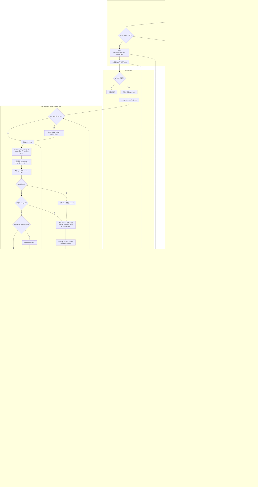

# Day 22 学习记录

## 1. 今天学习的文件

- `s14_cron_scheduler/code_openai.py` -- 基于 cron 表达式的定时任务调度系统

## 2. 核心概念

**四层架构解耦：调度线程只管"匹配时间推入队列"，agent 只管"消费队列执行"。两者通过 `cron_queue` 解耦，通过 `agent_lock` 互斥。**

s14 在 s13 后台任务基础上新增 cron 定时调度，解决"每天 9 点自动检查服务器"这类周期性任务需求。

### 四层架构

| 层 | 组件 | 职责 |
|---|---|---|
| 1. 调度层 | `cron_scheduler_loop` (daemon 线程) | 每秒轮询 cron 匹配 → 推入队列 |
| 2. 队列层 | `cron_queue` (由 `cron_lock` 保护的普通 list) | 解耦生产者和消费者 |
| 3. 投递层 | `queue_processor_loop` (daemon 线程) | 检测队列有货 + agent 空闲 → 唤醒 agent |
| 4. 消费层 | `agent_loop` | 消费队列 → 注入 prompt → LLM 执行 |

### 关键设计点

| 概念 | 说明 |
|---|---|
| cron 表达式匹配 | 5 字段（分/时/日/月/周），支持 `*`、`*/n`、`,`、`-`、精确值 |
| DOM/DOW OR 语义 | 日期和星期都受限制时满足其一即可（标准 Vixie cron 规范） |
| 一分钟防重 | `_last_queued` 记录每任务上次入队的 `YYYY-MM-DD HH:MM`，同分钟不重复 |
| 慢任务合并 | `_active_cron_ids` 记录已入队或正在执行的任务；任务未完成时再次命中只跳过，不形成积压 |
| 两类锁 | `cron_lock` 保护调度数据（jobs/queue/last），`agent_lock` 保证 agent 互斥执行 |
| 双重检查锁定 | `queue_processor_loop` 在抢锁前后各检查一次队列，抢到锁后防止白干活 |
| prompt 驱动 | 定时任务只保存 `prompt`，触发后由 LLM 决定调用什么工具，不保存固定 shell 命令 |
| 持久化 | `durable=true` 的任务保存到 `WORKDIR/.scheduled_tasks.json`，重启后恢复定义，但不补跑停机期间错过的任务 |
| one-shot 自动清理 | `recurring=false` 的任务入队后立即从 `scheduled_jobs` 删除，不等待 Agent 成功执行 |
| 线程启动时机 | 调度线程在模块加载时启动；自动投递线程只在 `__main__` CLI 入口启动 |
| 输出分层 | 默认只显示任务开始与 Agent 最终结果；设置 `CRON_DEBUG=1` 才显示排队、注入和工具调用轨迹 |

## 3. 关键代码

> 以下源码来自 [s14_cron_scheduler/code_openai.py](file:///d:/study/learn-claude-code/s14_cron_scheduler/code_openai.py)

### 3.1 CronJob 数据类与全局状态

```python
@dataclass
class CronJob:
    id: str          # cron_XXXXXX (6位随机数)
    cron: str        # "0 9 * * *" (5字段 cron 表达式)
    prompt: str      # 注入 LLM 的提示文本
    recurring: bool  # True=周期性, False=一次性
    durable: bool    # True=持久化到磁盘

# 全局状态
scheduled_jobs: dict[str, CronJob] = {}   # 注册表
cron_queue: list[CronJob] = []            # 待消费队列
cron_lock = threading.Lock()              # 保护以上数据
agent_lock = threading.Lock()             # agent 互斥锁
_last_queued: dict[str, str] = {}         # 防一分钟内重复入队
_active_cron_ids: set[str] = set()        # 防慢任务跨周期积压
```

### 3.2 cron 字段匹配：`_cron_field_matches`

```python
def _cron_field_matches(field: str, value: int) -> bool:
    if field == "*":              # 通配：任何值都命中
        return True
    if field.startswith("*/"):    # 步进：value % step == 0
        step = int(field[2:])
        return step > 0 and value % step == 0
    if "," in field:              # 枚举：递归匹配子值
        return any(_cron_field_matches(f.strip(), value)
                   for f in field.split(","))
    if "-" in field:              # 范围：lo <= value <= hi
        lo, hi = field.split("-", 1)
        return int(lo) <= value <= int(hi)
    return value == int(field)    # 精确：直接比较
```

五种语法的匹配优先级由代码顺序决定——上面的 `if` 命中就 return，不往下走。

### 3.3 完整匹配：`cron_matches`

```python
def cron_matches(cron_expr: str, dt: datetime) -> bool:
    minute, hour, dom, month, dow = cron_expr.strip().split()
    dow_val = (dt.weekday() + 1) % 7  # Python Mon=0 → cron Sun=0

    m = _cron_field_matches(minute, dt.minute)
    h = _cron_field_matches(hour, dt.hour)
    dom_ok = _cron_field_matches(dom, dt.day)
    month_ok = _cron_field_matches(month, dt.month)
    dow_ok = _cron_field_matches(dow, dow_val)

    # 分钟、小时、月份必须同时满足 (AND)
    if not (m and h and month_ok):
        return False
    # DOM 和 DOW：都用 * 则不限；仅一个受限则用它；两个都受限时 OR
    if dom == "*" and dow == "*":
        return True
    if dom == "*":
        return dow_ok
    if dow == "*":
        return dom_ok
    return dom_ok or dow_ok     # OR 语义
```

### 3.4 入队判断与防重：`should_enqueue`

```python
def should_enqueue(task_id, cron, now, last_queued) -> bool:
    if not cron_matches(cron, now):
        return False
    minute_marker = now.strftime("%Y-%m-%d %H:%M")
    if last_queued.get(task_id) == minute_marker:
        return False            # 本分钟已入队，不重复
    last_queued[task_id] = minute_marker
    return True
```

`last_queued` 是 `{job_id: "2026-01-15 09:30"}` 格式的 dict —— 精确到分钟，同一任务同一分钟最多入队一次。

### 3.5 调度主循环：`cron_scheduler_loop`

```python
def cron_scheduler_loop():
    while True:
        time.sleep(1)
        now = datetime.now()
        with cron_lock:
            for job in list(scheduled_jobs.values()):
                if should_enqueue(job.id, job.cron, now, _last_queued):
                    if job.id in _active_cron_ids:
                        continue                    # 上一次尚未完成，本次合并
                    cron_queue.append(job)        # 推入队列
                    _active_cron_ids.add(job.id)
                    if not job.recurring:
                        scheduled_jobs.pop(job.id, None)  # one-shot 自删
                        if job.durable:
                            save_durable_jobs()
```

`list(scheduled_jobs.values())` 拍快照——循环体内可能 `pop` 删除 one-shot 任务，遍历副本避免 `dict changed size during iteration`。

这里的“执行”仅指将任务放入 `cron_queue`。调度线程不会直接调用 LLM，也不会执行 `prompt` 对应的命令。任务被消费并完成 Agent turn 后，`run_agent_turn_locked()` 在 `finally` 中从 `_active_cron_ids` 删除对应 ID；即使 Agent 抛出异常，也不会永久卡在 active 状态。

### 3.6 队列投递：`queue_processor_loop`（双重检查锁定）

```python
def queue_processor_loop():
    while True:
        time.sleep(0.2)
        if not has_cron_queue():          # 第1次检查（无锁快速路径）
            continue
        if not agent_lock.acquire(blocking=False):  # 抢不到锁 → 跳过
            continue
        try:
            if not has_cron_queue():      # 第2次检查（有锁，防白干活）
                continue
            run_agent_turn_locked()       # 消费队列 + 调用 LLM
        finally:
            agent_lock.release()          # 异常也要释放
```

两次 `has_cron_queue()` 检查之间的窗口期，队列可能被并发运行的 agent_loop 清空。

### 3.7 工具注册

```python
# 3 个 LLM 可调用的工具
run_schedule_cron(cron, prompt, recurring, durable)
run_list_crons()
run_cancel_cron(job_id)

# TOOLS 定义中 schedule_cron 的参数说明
schedule_cron:
    cron: "5-field cron expression"
    prompt: "Message to inject when triggered"
    recurring: "True=recurring, False=one-shot"
    durable: "True=persist to disk"
```

### 3.8 持久化

```python
def save_durable_jobs():
    durable = [asdict(j) for j in scheduled_jobs.values() if j.durable]
    DURABLE_PATH.write_text(json.dumps(durable, indent=2))

def load_durable_jobs():
    jobs = json.loads(DURABLE_PATH.read_text())
    for j in jobs:
        job = CronJob(**j)
        if validate_cron(job.cron) is None:     # 校验通过才加载
            scheduled_jobs[job.id] = job

# 启动时加载 → 启动调度线程
load_durable_jobs()
threading.Thread(target=cron_scheduler_loop, daemon=True).start()

# 仅从 CLI 主入口运行时，启动自动投递线程
if __name__ == "__main__":
    threading.Thread(target=queue_processor_loop, daemon=True).start()
```

`DURABLE_PATH = WORKDIR / ".scheduled_tasks.json"`，其中 `WORKDIR = Path.cwd()`，所以文件位置取决于启动命令所在目录，而不是 `code_openai.py` 所在目录。`load_durable_jobs()` 只恢复任务定义；进程关闭期间没有调度线程运行，也没有补偿执行逻辑。

### 3.9 控制台输出分层

默认模式面向使用者，只输出一次清晰的定时任务分组：

```text
[scheduled task] cron_123456 @ 2026-07-24 16:35:08
  Print the current date.
[scheduled result]
2026-07-24 16:35:08
```

`> bash`、`[cron queued]`、`[inject cron]` 和工具原始返回值属于内部执行轨迹，默认隐藏，避免工具输出与 Agent 最终回复重复。需要学习或排查内部流程时，在启动前设置 `$env:CRON_DEBUG='1'`；此时 `cron_debug()` 才会打印这些信息。

## 4. 我理解的流程



这张图对应三个同时运行的循环：主线程的 `input` 循环、每秒运行的调度循环、每 200ms 运行的投递循环。需要注意，待处理的 cron 队列不一定由 `queue_processor_loop` 消费；如果用户先获得 `agent_lock` 并进入 `agent_loop`，用户触发的这一轮也会在开头调用 `consume_cron_queue()`，同时处理已经入队的定时任务。

## 5. 定时任务如何扩展 Agent 行为

### 5.1 从用户驱动扩展为时间驱动

没有 cron 时，Agent 只能在用户输入后进入 `agent_loop`。cron 调度器增加了一种新的事件来源：即使没有用户输入，只要时间表达式匹配，也可以通过队列处理线程主动启动一轮 Agent。

```text
普通交互：用户输入 → run_agent_turn_locked() → agent_loop
定时触发：时间匹配 → cron_queue → queue_processor_loop → run_agent_turn_locked() → agent_loop
```

两条路径最终复用同一个 `agent_loop`、工具集合、会话历史和 `agent_lock`，因此 cron 不需要复制一套 Agent 执行逻辑。它扩展的是 Agent 的**触发方式**，不是新增业务能力。

### 5.2 cron 与 background task 的关系

| 机制 | 解决的问题 | 输入 | 输出 |
|---|---|---|---|
| cron | 什么时候启动一次 Agent 工作 | cron 表达式 + prompt | 向 `cron_queue` 放入 `CronJob` |
| background task | Agent 已决定调用工具后，耗时工具如何异步执行 | tool call | 后台线程结果和 `task_notification` |

两者处于不同阶段：cron 在 Agent 运行之前产生时间事件，background task 在 Agent 运行期间处理工具调用。cron 任务本身不会自动变成 background task，也不会直接执行 shell 命令。

组合后的完整路径是：

```text
cron 时间匹配
→ CronJob 入队
→ queue_processor_loop 唤醒 Agent
→ agent_loop 注入 [Scheduled] prompt
→ LLM 根据 prompt 决定是否调用工具
→ should_run_background() 判断同步或后台执行
→ 后台任务完成后以 task_notification 返回 Agent
```

例如，“每天 9 点检查服务器并生成报告”中，cron 负责每天 9 点唤醒 Agent；Agent 决定执行检查命令；如果检查耗时较长，该工具调用可以再交给 background task，避免阻塞当前工具处理流程。

### 5.3 能力边界

- `.scheduled_tasks.json` 保存的是自然语言 `prompt`，不是固定可执行命令；每次触发后仍要调用 LLM 决定具体动作。
- cron 和 background task 都依赖当前 Python 进程；进程退出后，daemon 线程随之停止。
- `durable=true` 只保证任务定义在重启后恢复，不代表停机期间仍会执行，也不会自动补跑错过的时间点。
- `agent_lock` 保证用户输入触发和 cron 触发不会同时运行两轮 Agent；Agent 忙碌时，定时任务先留在队列中等待。

**结论：定时任务把 Agent 从“仅响应用户输入”扩展为“用户输入 + 时间事件”双重驱动；background task 则进一步扩展了单轮 Agent 中工具执行的并发方式。**

## 6. 仍然不清楚的问题

- `cron_queue` 是普通 list 不是 `queue.Queue`，没有内置的阻塞等待机制，processor 靠 200ms 轮询——为什么不用 `queue.Queue` 让 processor `get()` 直接阻塞等待？
- `_last_queued` 以 `job.id` 为 key，所以相同 cron 表达式的不同任务不会互相抑制；但任务取消后对应记录不会清理，长时间运行并频繁创建任务时是否会持续增长？
- `save_durable_jobs()` 使用全量覆盖写，而且 `schedule_job()` / `cancel_job()` 在释放 `cron_lock` 后才写文件；并发保存时如何避免旧快照覆盖新状态，为什么不在锁内生成快照后通过临时文件原子替换？
- one-shot 在“入队”而不是“执行成功”后删除；如果随后 LLM 请求失败，是否应该设计重试、确认或死信队列？

## 7. 明天要验证的点

- s15 是否有超时取消、任务优先级、子任务等增强功能
- 真实 CC 中 cron 是直接复用系统 crontab 还是自己实现调度引擎
