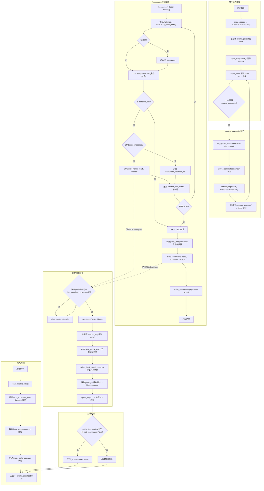

# Day 23 学习记录

## 1. 今天学习的文件

- `s15_agent_teams/code_openai.py` -- 基于 MessageBus 的多 Agent 协作系统

## 2. 核心概念

**Agent Teams = MessageBus（文件邮箱） + spawn_teammate_thread（daemon 线程） + inbox 注入（Lead 被动收件）。Lead 通过 spawn_teammate 派发任务，teammate 在独立线程中运行简化版 agent_loop，通过 MessageBus 回传结果。**

s15 在 s14 cron 调度基础上新增 Agent 团队协作，解决"单个 Agent 能力有限，需要多个 Agent 并行工作"的需求。

### 三层架构

| 层 | 组件 | 职责 |
|---|---|---|
| 1. 通信层 | `MessageBus`（文件 .jsonl 邮箱） | Agent 间异步消息传递，send/read_inbox/peek |
| 2. 线程层 | `spawn_teammate_thread`（daemon 线程） | 在后台启动 teammate，独立运行 agent_loop |
| 3. 唤醒层 | `inbox_poller`（daemon 线程） + 统一事件队列 | 检测收件箱或后台任务变化 → 唤醒 Lead |

### 关键设计点

| 概念 | 说明 |
|---|---|
| 文件邮箱 | `MAILBOX_DIR / "{agent}.jsonl"` — 每个 agent 一个 .jsonl 文件，append 追加，read+unlink 消费 |
| 消费语义 | `read_inbox()` = read_text + unlink，读后即删，每条消息只被消费一次 |
| 非破坏性检查 | `peek()` 只检查文件是否存在且非空，不读内容，用于 inbox_poller 轮询 |
| 队友 10 轮限制 | 教学版 teammate 最多 10 轮 agent_loop，完成后自动发送结果摘要并退出 |
| 队友工具集 | bash / read_file / write_file / send_message — 比 Lead 精简，无任务系统/cron |
| send_message 实现 | Lambda 元组技巧：`(BUS.send(...), "Sent")[1]` — 先执行副作用再返回固定字符串 |
| 统一事件队列 | `queue.Queue()` 汇集两类事件：用户输入（"user"）和异步唤醒（"wake"） |
| input_ready 门控 | `threading.Event()` 控制 input() 暂停/恢复，防止工具日志与提示符交错 |
| 队友完成追踪 | `active_teammates: dict[str, bool]` — 注册表，所有队友完成后打印 `[all teammates done]` |
| 快照遍历 | `list(scheduled_jobs.values())` — 循环体内可能 pop 删除，遍历副本避免 RuntimeError |

## 3. 关键代码

> 以下源码来自 [s15_agent_teams/code_openai.py](file:///d:/study/learn-claude-code/s15_agent_teams/code_openai.py)

### 3.1 MessageBus：文件邮箱

```python
MAILBOX_DIR = WORKDIR / ".mailboxes"

class MessageBus:
    def send(self, from_agent, to_agent, content, msg_type="message"):
        msg = {
            "from": from_agent, "to": to_agent,
            "content": content, "type": msg_type, "ts": time.time(),
        }
        inbox = MAILBOX_DIR / f"{to_agent}.jsonl"
        with open(inbox, "a") as f:
            f.write(json.dumps(msg) + "\n")

    def read_inbox(self, agent: str) -> list[dict]:
        """读取并清空指定 agent 的邮箱（读取后删除文件，即消费消息）。"""
        inbox = MAILBOX_DIR / f"{agent}.jsonl"
        if not inbox.exists():
            return []
        msgs = [json.loads(line)
                for line in inbox.read_text().splitlines() if line.strip()]
        inbox.unlink()  # consume: read + delete
        return msgs

    def peek(self, agent: str) -> bool:
        """非破坏性检查：指定 agent 是否有未读邮件。"""
        inbox = MAILBOX_DIR / f"{agent}.jsonl"
        return inbox.exists() and inbox.stat().st_size > 0

BUS = MessageBus()
```

教学版无文件锁，真实 CC 使用 `proper-lockfile` 保证并发写入安全。

### 3.2 队友线程：`spawn_teammate_thread`

```python
def spawn_teammate_thread(name: str, role: str, prompt: str) -> str:
    system = (
        f"You are '{name}', a {role}. "
        f"Use tools to complete tasks. "
        f"Send results via send_message to 'lead'."
    )

    def run():
        messages = [{"role": "user", "content": prompt}]
        sub_tools = [...]  # bash, read_file, write_file, send_message
        sub_handlers = {
            "bash": run_bash,
            "read_file": run_read,
            "write_file": run_write,
            # Lambda 元组技巧：先执行 BUS.send() 副作用，再返回 "Sent"
            "send_message": lambda to, content: (
                BUS.send(name, to, content), "Sent"
            )[1],
        }

        for _ in range(10):                    # 教学版 10 轮上限
            inbox = BUS.read_inbox(name)       # 先收件
            if inbox:
                messages.append({"role": "user",
                    "content": f"<inbox>{json.dumps(inbox)}</inbox>"})
            response = client.responses.create(
                model=MODEL, instructions=system,
                input=messages[-20:],           # 仅保留最近 20 条
                tools=sub_tools, max_output_tokens=8000,
            )
            messages.extend(as_input_item(item) for item in response.output)
            if not function_calls(response):    # LLM 无工具调用 → 结束
                break
            # 执行工具调用...
            results = [...]
            messages.extend(results)

        # 完成后向 Lead 发送摘要
        summary = "Done."
        for msg in reversed(messages):         # 倒序找最后一条 assistant 文本
            if msg.get("role") == "assistant" and ...:
                summary = b.text; break
        BUS.send(name, "lead", summary, "result")
        active_teammates.pop(name, None)

    active_teammates[name] = True
    threading.Thread(target=run, daemon=True).start()
    return f"Teammate '{name}' spawned as {role}"
```

关键点：
- `input=messages[-20:]` 截断历史，防止队友上下文无限膨胀
- `if not function_calls(response): break` — LLM 文本回复视为任务完成
- 摘要是倒序找到最后一条 assistant 文本，而非简单取最后一条消息
- `active_teammates.pop(name, None)` — 完成后从注册表移除；用 `None` 做默认值避免并发重复移除时的 KeyError

### 3.3 工具处理器

```python
# Lead 的 3 个新工具
def run_spawn_teammate(name, role, prompt) -> str:
    return spawn_teammate_thread(name, role, prompt)

def run_send_message(to, content) -> str:
    BUS.send("lead", to, content)
    return f"Sent to {to}"

def run_check_inbox() -> str:
    msgs = BUS.read_inbox("lead")
    if not msgs:
        return "(inbox empty)"
    return "\n".join(f"  [{m['from']}] {m['content'][:200]}" for m in msgs)
```

`check_inbox` 是 Lead 主动调用的方式；异步唤醒路径（inbox_poller）是被动接收方式。两条路径最终都调用 `BUS.read_inbox("lead")`，消费语义相同。

### 3.4 统一事件队列（主循环）

```python
events = queue.Queue()
input_ready = threading.Event()
input_ready.set()

def input_reader():
    """用户输入线程：阻塞等待 stdin。"""
    while True:
        input_ready.wait()
        input_ready.clear()
        try:
            line = input("\033[36ms15 >> \033[0m")
        except (EOFError, KeyboardInterrupt):
            events.put(("quit", None))
            return
        events.put(("user", line))

def inbox_poller():
    """收件箱轮询线程：每 1 秒检查队友消息或后台任务。"""
    while True:
        time.sleep(1)
        if BUS.peek("lead") or has_pending_background():
            events.put(("wake", None))

# 主循环
while True:
    kind, payload = events.get()
    if kind == "user":
        history.append({"role": "user", "content": payload})
    else:  # "wake"
        inbox = BUS.read_inbox("lead")
        bg = collect_background_results()
        history.append({"role": "user",
            "content": "[Inbox]\n" + formatted_inbox + bg_notifications})

    input_ready.clear()          # 暂停 input() 提示符
    try:
        agent_loop(history, context)
        # 所有队友完成且队列清空 → 打印通知
        if not active_teammates and had_teammates:
            print("\033[32m[all teammates done]\033[0m")
    finally:
        input_ready.set()        # 恢复 input() 提示符
```

三线程协作：
- `input_reader`：阻塞等待用户输入 → 放入事件队列
- `inbox_poller`：每秒检查收件箱/后台任务 → 有变化时放入 "wake" 事件
- 主线程：`events.get()` 阻塞等待任一事件 → 执行一轮 agent_loop

### 3.5 队友 send_message 的 Lambda 元组技巧

```python
"send_message": lambda to, content: (BUS.send(name, to, content), "Sent")[1],
```

`BUS.send()` 返回 `None`，`(None, "Sent")[1]` 返回 `"Sent"`。一行完成"副作用调用 + 返回固定字符串"。等价于：

```python
def _send(to, content):
    BUS.send(name, to, content)
    return "Sent"
```

Lambda 版本更紧凑，但可读性略差。教学代码刻意展示这种 Python 技巧。

## 4. 我理解的流程



## 5. Agent Teams 如何扩展 Agent 行为

### 5.1 从单 Agent 扩展到多 Agent 协作

没有 Agent Teams 时，所有工作由单个 Agent 串行完成。s15 引入了一种新的工作模式：Lead 可以将子任务委派给 teammate，teammate 在独立线程中并行执行，完成后通过 MessageBus 回传结果。

```text
s14 及之前：用户输入 → agent_loop → 工具调用 → 返回结果
s15 新增： 用户输入 → agent_loop → spawn_teammate → teammate 独立 agent_loop
                                              ↓
              inbox_poller 检测到邮件 → wake 事件 → Lead agent_loop 处理结果
```

### 5.2 两条收件路径

| 路径 | 触发方式 | 场景 |
|---|---|---|
| 主动收件 (`check_inbox`) | Lead 的 LLM 主动调用工具 | Lead 知道有队友在工作，主动查询进度 |
| 被动收件 (inbox_poller) | 后台线程轮询检测到邮件 | Lead 正在等待用户输入，队友异步完成 |

两条路径都调用 `BUS.read_inbox("lead")`，消费语义一致。区别在于：主动路径由 LLM 决策何时查询，被动路径由系统自动注入，不消耗 Lead 的工具调用轮次。

### 5.3 与 background task 的关系

| 机制 | 解决的问题 | 执行主体 | 通信方式 |
|---|---|---|---|
| background task | 耗时命令不阻塞 agent_loop | daemon 线程执行单个 shell 命令 | `task_notification` XML 注入 |
| agent team | 复杂子任务需要多轮 LLM 推理 | daemon 线程运行完整 agent_loop | MessageBus 文件邮箱 |

background task 执行的是**单个工具调用**（如 `npm install`），无 LLM 推理能力。teammate 执行的是**完整 agent_loop**，可以自主决策、调用多个工具、多轮推理。teammate 也可以在自己的 agent_loop 中使用 background task。

### 5.4 能力边界

- 教学版 teammate 硬限制 10 轮，真实 CC 使用 idle loop 无上限
- `BUS.send()` 使用文件 append 无锁，多 teammate 并发写同一邮箱时可能行交错（真实 CC 用 `proper-lockfile`）
- `read_inbox()` 是消费语义（读后删除），如果 Lead 在 `check_inbox` 和 inbox_poller 之间竞态，消息可能被其中一方消费，另一方看到空邮箱
- teammate 的 `input=messages[-20:]` 截断可能导致丢失早前的上下文
- 队友异常（API 调用失败）只 `break` 退出循环，不向 Lead 报告失败原因

**结论：Agent Teams 把 Agent 从"单兵作战"扩展为"Team Leader + Specialist"模式，通过 MessageBus 实现异步解耦，通过 inbox_poller 实现被动唤醒。这是从 s15 开始的一系列团队协作模式的基础。**

## 6. 仍然不清楚的问题

- `BUS.read_inbox()` 先 `read_text()` 再 `unlink()`，中间如果程序崩溃，消息会丢失（不是原子操作）——真实 CC 如何处理这个 at-least-once / at-most-once 语义？
- `inbox_poller` 每秒检查一次，队友结果在检查间隔内到达会有最多 1 秒延迟——对于对延迟敏感的场景（如用户正在等待），是否有"队友完成立即唤醒"的机制？
- 队友 agent_loop 和 Lead agent_loop 共享 `client`（同一个 OpenAI 连接），多线程并发调用 Responses API 是否安全？是否需要连接池？
- 如果 Lead 同时 spawn 多个 teammate，它们可能并发写同一个 `lead.jsonl` 文件——文件 append 在 Python 中是否保证原子性？消息边界是否可能交错？
- `active_teammates.pop(name, None)` 用 `None` 避免并发重复移除的 KeyError——什么场景下会并发 pop 同一个 name？

## 7. 明天要验证的点

- s16（team_protocols）引入了什么协议机制来规范 Lead 和 teammate 之间的通信模式
- 真实 CC 中 teammate 的 idle loop 如何实现，与教学版 10 轮硬限制的区别
- 多 teammate 并行时 MessageBus 的并发安全性如何保证
