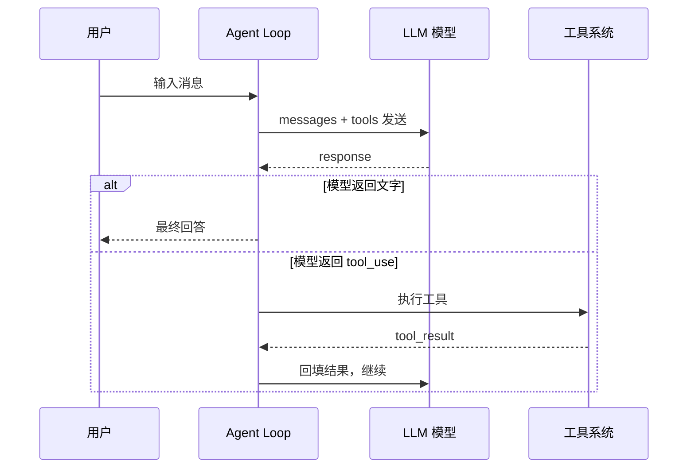

# 第 1 周复盘：最小 `Coding Agent`

回顾 `s01_agent_loop` → `s02_tool_use` → `s03_permission` → `s04_hooks`。

---

## 1. 最小 `coding agent` 需要哪些模块

一个能跑起来的 `coding agent` 最少需要 **5 个模块**：

| 模块 | 对应代码 | 作用 |
|---|---|---|
| **模型调用** | `client.responses.create()` | 向 `LLM` 发送消息，获取响应（文字或工具调用） |
| **Agent Loop** | `agent_loop(messages)` | 循环：调用模型 → 执行工具 → 回填结果 → 重复，直到模型返回最终答案 |
| **工具定义（Schema）** | `TOOLS = [{...}]` | 告诉模型有哪些工具可用、每个工具接收什么参数 |
| **工具执行（Handlers）** | `TOOL_HANDLERS = {"bash": run_bash, ...}` | 真正执行命令/文件操作的函数 |
| **对话历史** | `messages = []` | 记录全部交互（用户消息 + 模型回复 + 工具调用/结果），是模型唯一的上下文 |

**它们之间的关系：**



---

## 2. 工具系统和权限系统如何协作

工具系统和权限系统是**两层防御**：

### 工具系统（负责"能不能做"）

- `safe_path()` — 限制文件操作只能在工作区目录内（`s01`）
- 输出截断 — `out[:50000]` 防止过大（`s01`）
- 超时控制 — `timeout=120` 防止命令卡死（`s01`）

### 权限系统（负责"让不让做"）

- 危险命令拦截 — `"rm "`, `"> /etc/"`, `"chmod 777"` 等关键词过滤（`s03`）
- `require_user_approval` — 敏感命令需要用户手动确认（`s03`）

### 协作流程

```
模型要执行命令
    ↓
工具系统检查：路径合法？超时可控？
    ↓ （通过）
权限系统检查：是危险命令？需要用户批准？
    ↓ （通过）
执行命令，返回结果
```

**工具系统和权限系统的职责区别：**

| | 工具系统 | 权限系统 |
|---|---|---|
| 关注点 | 功能正确性 | 安全策略 |
| 例子 | `safe_path` 确保路径不越界 | 关键词拦截阻止 `rm -rf /` |
| 谁实现 | `common/tools.py` | `agent loop` 中的 `if` 判断 + `hooks` |
| 可配置 | 否（硬编码） | 是（通过 `hooks` 可插拔） |

---

## 3. `hooks` 给 `harness` 带来了什么扩展能力

`harness` 就是 `agent loop` 的外壳——管理 `prompt`、工具、循环流程的框架代码。

在 `s03` 之前，安全策略直接写在 `agent loop` 里：

```python
# 硬编码（s03）
if "rm " in command or "chmod 777" in command:
    return "Blocked: dangerous command"
```

在 `s04`，`hooks` 把这些策略**从 loop 中抽离**：

```python
# 可插拔（s04）
blocked = trigger_hooks("PreToolUse", block)   # 执行前
trigger_hooks("PostToolUse", block, output)     # 执行后
force = trigger_hooks("Stop", messages)         # 退出前
```

**hooks 带来的 5 个扩展能力：**

| 能力 | 说明 | 示例 |
|---|---|---|
| **可插拔** | 不修改主循环代码就能加/删策略 | 加一个审计 hook 不需要动 agent_loop |
| **生命周期介入** | 在关键节点（工具执行前、执行后、停止前）嵌入逻辑 | PreToolUse 拦截危险命令 |
| **策略独立** | 每个 hook 管一件事，互不干扰 | 安全检查、输出截断、日志记录各写各的 |
| **可组合** | 多个 hook 可以按序串联执行 | PreToolUse → 安全检查 → 输出裁剪 → 审计记录 |
| **影响流程** | hook 返回值可以中断执行或强制继续 | Stop hook 返回文字 → 注入新消息，Agent 继续跑 |

**一句话总结：**

> hooks 把"写死在 loop 里的策略"变成了"按需挂载的插件"，让 harness 从硬编码框架升级为可扩展平台。
