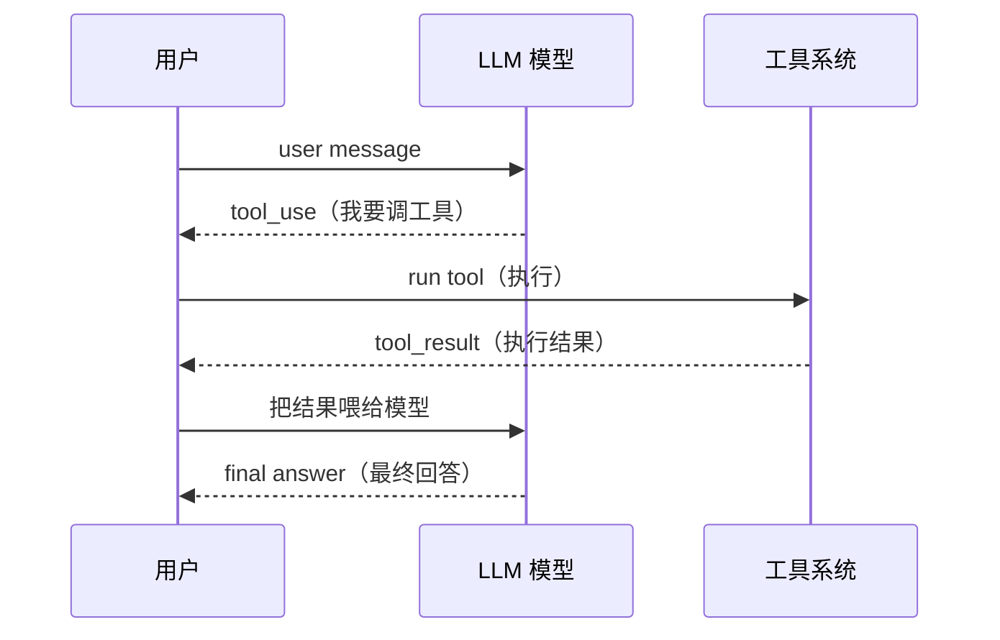

# 第 1 周：建立 agent 基础模型

本周目标：理解最小 `coding agent` 是如何工作的。重点是 `agent loop`、工具调用、权限控制和 `hooks`。

## Day 1：项目总览

### 学习材料

- `README-zh.md`
- `docs/code-graph.md`
- `docs/learning-plan/01-project-positioning.md`
- `docs/learning-plan/02-code-structure.md`

### 具体任务

1. 浏览项目顶层目录。
2. 标出 `Python` 示例、课程文档、前端网站三个区域。
3. 阅读 code graph，理解项目依赖关系。

### 产出

写下：

- 项目三大模块是什么
  - agents
  - test
  - web
- 课程主线是什么
  - `coding agent`
- 你最不理解的 3 个概念是什么
  - 目前还没有

## Day 2：最小 `agent loop`

### 学习材料

- `s01_agent_loop/code.py`
- `agents/s01_agent_loop.py`

### 具体任务

1. 找到 `agent_loop(messages)`。
2. 找到 `run_bash(command)`。
3. 理解模型返回 `tool_use` 后，代码如何执行工具。
4. 理解工具结果如何作为 `tool_result` 放回 `messages`。

### 产出

画出这个流程：

**简化版：**

```text
user message
  -> model
  -> tool_use
  -> run tool
  -> tool_result
  -> model
  -> final answer
```


**关键代码对应：**

| 步骤 | 代码位置 |
|---|---|
| 调用模型 API | `client.responses.create(...)` |
| 无工具调用 → 返回 | `if not function_calls(response): return` |
| 解析 tool_use | `item.name` / `json.loads(item.arguments)` |
| 执行工具 | `TOOL_HANDLERS[name](**args)` |
| 构造 tool_result | `{"type": "function_call_output", ...}` |
| 追加到 history | `history.append(...)` |

## Day 3：工具调用系统

### 学习材料

- `s02_tool_use/code.py`
- `agents/s02_tool_use.py`

### 具体任务

1. 阅读工具 schema。
2. 对比 `bash`、`read`、`write`、`edit` 四类工具。
3. 找到 `safe_path` 并理解路径限制。

### 工具 Schema 参数详解

> 参考：`s01_agent_loop/code_openai.py` 中带详细注释的 `TOOLS` 定义。

| 字段            | 必填     | 类型           | 作用                                                                             |
| ------------- | ------ | ------------ | ------------------------------------------------------------------------------ |
| `type`        | 是      | `"function"` | 固定值，表示定义一个函数工具。目前 OpenAI 只支持这一种类型                                              |
| `name`        | 是      | `string`     | 工具的唯一标识名。模型返回 `function_call` 时用它指定要调哪个工具。命名规则：只能包含 `a-z A-Z 0-9 _ -`，最长 64 字符 |
| `description` | 是      | `string`     | 用自然语言描述工具的功能、使用场景、注意事项。这是模型判断「何时用这个工具」的核心依据。描述越清晰，模型越不容易误用或漏用                  |
| `parameters`  | 是      | `object`     | 工具的输入参数定义，格式为 JSON Schema：                                                     |
| <br />        | <br /> | <br />       | `type`: 固定 `"object"`，参数总是一个 JSON 对象                                           |
| <br />        | <br /> | <br />       | `properties`: 参数列表。每个参数有 `type`（类型）和可选的 `description`（说明）、`enum`（允许值）          |
| <br />        | <br /> | <br />       | `required`: 必填参数名列表，模型必须提供这些参数                                                 |
| <br />        | <br /> | <br />       | `additionalProperties`: `false` 阻止模型自由发挥传额外参数                                  |
| `strict`      | 否      | `bool`       | `true` 时模型必须严格按 schema 生成参数；`false` 时模型可以返回未定义的字段。生产环境建议始终设为 `true`            |

**一个完整的工具定义示例：**

```python
{
    "type": "function",          # 固定值
    "name": "bash",              # 工具名
    "description": "Run a shell command. Use for file ops, git, etc.",
    "parameters": {              # 参数定义（JSON Schema）
        "type": "object",
        "properties": {
            "command": {"type": "string", "description": "The shell command"}
        },
        "required": ["command"],
        "additionalProperties": False,
    },
    "strict": True,
}
```

**如何扩展新工具：**

只需要 3 步：

1. 在 `TOOLS` 列表中添加一个新条目（定义 schema）
2. 在 `TOOL_HANDLERS` 字典中注册处理函数（`"工具名": 处理函数`）
3. 实现处理函数，接收参数，返回执行结果字符串

### 产出

写出一张表：

| 工具    | 输入                               | 输出                                               | 风险                                    | 防护                                 |
| ----- | -------------------------------- | ------------------------------------------------ | ------------------------------------- | ---------------------------------- |
| bash  | `command`: shell 命令字符串           | stdout + stderr（最多 50K 字符），超时返回 `Error: Timeout` | 可执行任意命令（`rm`、`chmod`、`git push -f` 等） | 超时 120s、输出截断、危险命令关键词拦截             |
| read  | `path` + 可选 `limit` 行数           | 文件内容字符串，超出 limit 行时尾部追加 `... (N more lines)`     | 路径越界（读取工作区外的文件）                       | `safe_path`：解析后验证路径必须落在工作区下        |
| write | `path` + `content`               | `"Wrote N bytes to path"`                        | 路径越界、覆盖已有文件                           | `safe_path`：限制在工作区内；自动创建父目录        |
| edit  | `path` + `old_text` + `new_text` | `"Edited path"` 或 `"Error: text not found"`      | 路径越界、修改文件内容                           | `safe_path`：限制在工作区内；仅替换首次出现，不会误改多处 |

## Day 4：工具扩展练习

### 具体任务

设计一个 `list_files` 工具，不要求提交代码，但要写出：

1. 工具 schema。
2. 执行函数签名。
3. 路径安全策略。
4. 返回值格式。

### 产出

写出 `list_files` 的最小设计草稿。

- 工具 `schema`。

```python
# list_files tool schema
{
    "type": "function",
    "name": "list_files",
    "description": "List files in a directory",
    "parameters": {
        "type": "object",
        "properties": {
            "path": {
                "type": "string",
                "description": "Path to list files in"
            }
        },
        "required": ["path"]
    },
    "strict": true
}
```

- 执行函数签名。

```python
# list_files tool execution function
def list_files(path: str) -> list[str]:
    """List files in a directory."""
    return os.listdir(path)
```

- 路径安全策略。
  - 工具只能在工作区范围内执行。
  - 工具不能访问工作区外部的文件或目录。
  - 工具不能执行危险操作，如删除文件、修改文件权限等。
  ```python
  def is_safe_path(path: str) -> bool:
      """检查路径是否在工作区范围内。"""
      return (WORKDIR / path).resolve().is_relative_to(WORKDIR)
  ```
- 返回值格式。
  - 工具返回值为文件名列表。
  - 工具返回值为空时，返回空列表。

## Day 5：权限控制

### 学习材料

- `s03_permission/code.py`
- `s03_permission/README.md`

### 具体任务

1. 找到危险操作判断逻辑。

```python
# Pipeline: all three gates chained
def check_permission(block) -> bool:
    """依次执行拒绝列表、规则匹配和用户确认三道权限检查。"""
    if block.name == "bash":
        # 检查 bash 命令是否命中绝对禁止执行的危险模式
        reason = check_deny_list(call_args(block).get("command", ""))
        if reason:
            print(f"\n\033[31m⛔ {reason}\033[0m")
            return False
    reason = check_rules(block.name, call_args(block))
    if reason:
        decision = ask_user(block.name, call_args(block), reason)
        if decision == "deny":
            return False
    return True
```

```python
  # Gate 1: Hard deny list — always forbidden
  DENY_LIST = ["rm -rf /", "sudo", "shutdown", "reboot", "mkfs", "dd if=", "> /dev/sda"]
  def check_deny_list(command: str) -> str | None:
      """检查命令是否命中绝对禁止执行的危险模式。"""
      for pattern in DENY_LIST:
          if pattern in command:
              return f"Blocked: '{pattern}' is on the deny list"
      return None
```

```python
  # Gate 2: Rule matching — context-dependent checks
  PERMISSION_RULES = [
      {
          "tools": ["write_file", "edit_file"],
          # 检查写入路径是否在工作区范围内
          "check": lambda args: not (WORKDIR / args.get("path", ""))
          .resolve()
          .is_relative_to(WORKDIR),
          "message": "Writing outside workspace",
      },
      {
          "tools": ["bash"],
          # 如果 bash 命令中包含 rm 、 > /etc/ 或 chmod 777 三个危险关键词中的 任意一个 ，就触发权限拦截。
          # 检查命令是否包含危险模式
          # any()：如果序列中的任意元素为 True，返回 True；否则返回 False。
          "check": lambda args: any(
              kw in args.get("command", "").lower()
              for kw in [
                  "rm ",
                  "del ",
                  "erase ",
                  "rmdir ",
                  "rd ",
                  "remove-item",
                  "unlink ",
                  "os.remove",
                  "os.unlink",
                  ".unlink(",
                  "shutil.rmtree",
                  "> /etc/",
                  "chmod 777",
              ]
          ),
          "message": "Potentially destructive command",
      },
  ]
  def check_rules(tool_name: str, args: dict) -> str | None:
      """按工具名称执行上下文权限规则，返回命中原因或 None。"""
      for rule in PERMISSION_RULES:
          if tool_name in rule["tools"] and rule["check"](args):
              return rule["message"]
      return None
```

1. 理解哪些操作应该被拦截。
   - 检查写入路径是否在工作区范围内
   - 检查 `bash` 命令是否包含危险模式
   - 检查用户确认是否同意危险操作
2. 思考权限系统是工具层能力，还是模型层能力。
   - 权限检查应该放在工具层，因为工具是模型调用的，模型不知道工具的权限。

### 产出

总结：

- 哪些操作需要拦截
  -  检查写入路径是否在工作区范围内
  -  检查 `bash` 命令是否包含危险模式
  -  检查用户确认是否同意危险操作
- 为什么只靠 `prompt` 不够
  - 因为 `prompt` 只能描述操作，不能执行操作。
  - 模型不知道工具的权限，只能依赖工具的权限检查。
- 权限检查应该放在哪一层
  - 权限检查应该放在工具层，因为工具是模型调用的，模型不知道工具的权限。

## Day 6：`hooks` 机制

### 学习材料

- `s04_hooks/code.py`
- `s04_hooks/README.md`

### 具体任务

1. 找到 `hook` 的调用点。
2. 区分 `before hook` 和 `after hook`。
3. 思考 `hook` 可以用于日志、安全、格式化、测试等哪些场景。

### 产出

写出 `3` 个 `hook` 使用场景。

- 日志记录
- 安全检查
- 格式化输出
- 输出大小检查

## Day 7：第 1 周复盘

### 具体任务

回顾 `s01` 到 `s04`。

### 产出

写一页总结：

- 最小 `coding agent` 需要哪些模块
- 工具系统和权限系统如何协作
- `hooks` 给 harness 带来了什么扩展能力

